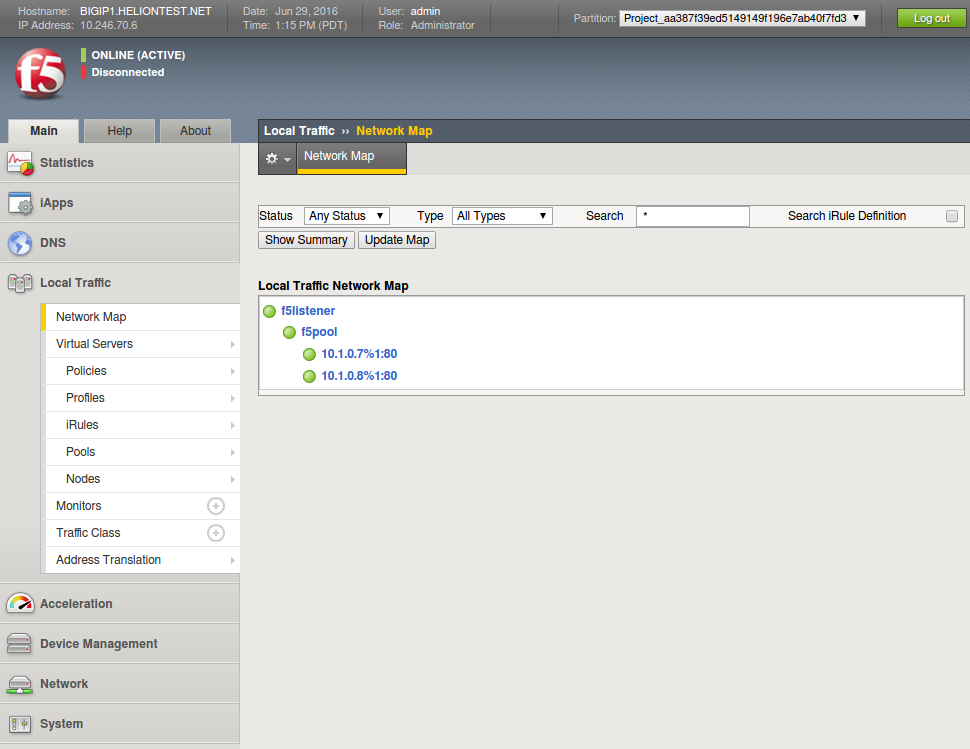

# Introduction

[F5 BIG-IP](https://f5.com/products/big-ip) provides a hardware local traffic manager (LTM), and Helion OpenStack 3.0 supports using the LTM as a Neutron load balancer as a service (API version 2).

* * *

# Installation

In this documentation, we configure a **F5 BIG-IP 3600** running **BIG-IP 12.0.0 (Build 0.0.606)** to run as a load balancer for Neutron LBaaSv2.  The installation uses a VXLAN tunnel (VTEP) to connect a private network from the Helion OpenStack cloud to the F5 BIG-IP appliance.

HTTPS/TLS load balancing with certificates stored in OpenStack Barbican is supported with some additional configuration.

## Prerequisites

### Network

This installation uses tagged VLANs for different networks in the cloud.  These are the networks that apply to the F5 load balancer integration:

*   Management ― Both the Helion OpenStack controller nodes and the F5 appliance need to be on this network so that Neutron can reach the F5 iControl API.  You may or may not put this on a different VLAN from the Helion OpenStack management network.  As long as the controller nodes can access the iControl API, any network would suffice.
*   Virtual Tunnel Endpoint (VTEP) ― This endpoint is one IP address on the network group that provides private networks to virtual machines.  In the sample Helion OpenStack definition, the network group is called "GUEST".
*   Internet access on the Helion Lifecycle Manager and the controller nodes is required to run the F5 integration playbook because the playbook downloads official F5 software releases and their dependencies.

### F5 BIG-IP Configuration

In the BIG-IP control panel:

1.  Ensure that the F5 appliance has the correct license.  The license (System ›› License ›› Active Modules _or_ `tmsh show sys license`) needs to contain "SDN Services" as an active module so that the F5 appliance can activate the VXLAN listener.
2.  Configure the VLAN.  In Network ›› VLANs, define a VLAN with the correct tag in the "Common" partition.  The name of the VLAN is your choice, but this guide assumes that you have named it "HOS_GUEST_VXLAN".
3.  Create a self IP in Network ›› Self IPs using "HOS_GUEST_VXLAN" as the "VLAN / Tunnel".  Use "VTEP" as the name.  Choose a free IP address in the data network.

## Integration

1.  Set up the F5 appliance first using the "F5 BIG-IP Configuration" instructions above.  If you are using OpenStack Barbican and wish to add HTTPS/TLS load balancing support, `~/helion/my_cloud/definition/data/network_groups.yml` must be configured with valid certificates in the `cert-file:` attributes, or if you are testing, you can use the special value `helion-internal-cert`.  See the "Caveats" section below for more information.
2.  Deploy Helion OpenStack 3.0 using the [official instructions](http://docs.hpcloud.com/#3.x/helion/installation/installing_esx_kvm_vsa.html).  The F5 installation must be done after the Helion OpenStack 3.0 deployment because F5 driver is not built into Helion OpenStack, and the F5 installation depends on the existence of Helion OpenStack Neutron environments.
3.  Ensure that the file `~/helion/my_cloud/config/neutron/neutron.conf.j2` is a symbolic link to `../../../hos/ansible/roles/neutron-common/templates/neutron.conf.j2` (absolute path: `/home/stack/helion/hos/ansible/roles/neutron-common/templates/neutron.conf.j2`).
4.  Edit `~/helion/my_cloud/config/neutron/neutron.conf.j2`. Under the `[service_providers]` section, add a line that reads:
    ```
service_provider = LOADBALANCERV2:F5Networks:neutron_lbaas.drivers.f5.driver_v2.F5LBaaSV2Driver:default
    ```
    and prepend a `#` character to the line that reads:
    ```
 {{ neutron_lbaas_providers }}
    ```
    If you do not wish to use F5 LBaaSv2 as the default driver, omit `:default` and do not prepend the `#` character.

5.  Update the local HOS Git repository with the changes:
    ```
    cd ~/helion
    git add -A
    git commit -m "Added F5 LBaaSv2 configuration for Neutron"
    ```
    _Nota bene:_ If you need to redeploy Helion OpenStack, you will need to undo this step and the previous step, or the redeployment will not succeed.

6.  Run the configuration preprocessor: `ansible-playbook -i ~/helion/hos/ansible/hosts/localhost ~/helion/hos/ansible/config-processor-run.yml`
7.  Run the scratch playbook generator: `ansible-playbook -i ~/helion/hos/ansible/hosts/localhost ~/helion/hos/ansible/ready-deployment.yml`
8.  Ensure that the `f5-oslbaasv2-agent` Neutron agent binary is not present:
    ```
    stack@helion-cp1-c0-m1-mgmt:~$ source ~/service.osrc 
    stack@helion-cp1-c0-m1-mgmt:~$ neutron agent-list
    +--------------------------------------+----------------------+--------------------------+-------+----------------+---------------------------+
    | id                                   | agent_type           | host                     | alive | admin_state_up | binary                    |
    +--------------------------------------+----------------------+--------------------------+-------+----------------+---------------------------+
    | 0d2cc9c3-3e9e-4106-9c20-3ea1279e9b1b | Metadata agent       | helion-cp1-comp0003-mgmt | :-)   | True           | neutron-metadata-agent    |
    | 10fca118-a3aa-4ff4-bee9-d0b529c367be | Open vSwitch agent   | helion-cp1-c1-m3-mgmt    | :-)   | True           | neutron-openvswitch-agent |
    | 141da94a-acad-4368-bcfc-456d8e46020e | Loadbalancerv2 agent | helion-cp1-comp0002-mgmt | :-)   | True           | neutron-lbaasv2-agent     |
    | 1dcdaa86-fde0-42fc-8e80-10dbb763a9c2 | L3 agent             | helion-cp1-c1-m1-mgmt    | :-)   | True           | neutron-vpn-agent         |
    | 259cbbca-cfbd-4535-b0ec-86e55ac3fe1e | Open vSwitch agent   | helion-cp1-c1-m1-mgmt    | :-)   | True           | neutron-openvswitch-agent |
    | 3268887d-dfb3-454d-9b88-a113b86cef51 | DHCP agent           | helion-cp1-c1-m3-mgmt    | :-)   | True           | neutron-dhcp-agent        |
    | 3e267a6e-4547-48ab-8a0f-ee1627568d32 | Metadata agent       | helion-cp1-c1-m3-mgmt    | :-)   | True           | neutron-metadata-agent    |
    | 3fc32632-ee72-41d4-bcfb-5675341959e7 | L3 agent             | helion-cp1-comp0001-mgmt | :-)   | True           | neutron-l3-agent          |
    | 6c72185e-a518-4638-a03c-79af90750e63 | DHCP agent           | helion-cp1-c1-m2-mgmt    | :-)   | True           | neutron-dhcp-agent        |
    | 768a61cd-d203-4ea6-a807-b6adf894fc54 | Loadbalancerv2 agent | helion-cp1-comp0001-mgmt | :-)   | True           | neutron-lbaasv2-agent     |
    | 7aa9bf81-fac7-4202-8b81-a47012731134 | Loadbalancerv2 agent | helion-cp1-comp0003-mgmt | :-)   | True           | neutron-lbaasv2-agent     |
    | 8ac2bdd6-dbe1-4872-a425-b15d72a8fe69 | Metadata agent       | helion-cp1-c1-m2-mgmt    | :-)   | True           | neutron-metadata-agent    |
    | 91aaa427-d847-4218-8314-592d1402ffd4 | Metadata agent       | helion-cp1-comp0001-mgmt | :-)   | True           | neutron-metadata-agent    |
    | 96b6521c-d43d-4b5e-8e9a-4014dee72223 | L3 agent             | helion-cp1-c1-m2-mgmt    | :-)   | True           | neutron-vpn-agent         |
    | b32af791-a71d-469c-aa27-f846d1187a58 | L3 agent             | helion-cp1-c1-m3-mgmt    | :-)   | True           | neutron-vpn-agent         |
    | b3bf9a60-fb03-4b2f-a725-77976fa51a6c | L3 agent             | helion-cp1-comp0003-mgmt | :-)   | True           | neutron-l3-agent          |
    | b86ab2e9-81b1-4c5f-bb5e-3dfcfbdb98dd | Open vSwitch agent   | helion-cp1-c1-m2-mgmt    | :-)   | True           | neutron-openvswitch-agent |
    | c1321e6c-2261-4829-8228-ece4548c1efd | Metadata agent       | helion-cp1-comp0002-mgmt | :-)   | True           | neutron-metadata-agent    |
    | c6689820-3917-457a-ab41-aacd78b5ac6d | Open vSwitch agent   | helion-cp1-comp0001-mgmt | :-)   | True           | neutron-openvswitch-agent |
    | d80d4cb1-8ec7-46ca-ab8e-52d4d67e9822 | DHCP agent           | helion-cp1-c1-m1-mgmt    | :-)   | True           | neutron-dhcp-agent        |
    | de2b6cad-4f60-4fc6-be57-8a63e22a4483 | L3 agent             | helion-cp1-comp0002-mgmt | :-)   | True           | neutron-l3-agent          |
    | eb4df5f4-d818-4268-82d9-fb110c2c8d0a | Open vSwitch agent   | helion-cp1-comp0002-mgmt | :-)   | True           | neutron-openvswitch-agent |
    | f4792434-bb90-4947-be2d-674d26dd7b3c | Open vSwitch agent   | helion-cp1-comp0003-mgmt | :-)   | True           | neutron-openvswitch-agent |
    | fddee5b2-98aa-412d-8705-abecc2fe0ab7 | Metadata agent       | helion-cp1-c1-m1-mgmt    | :-)   | True           | neutron-metadata-agent    |
    +--------------------------------------+----------------------+--------------------------+-------+----------------+---------------------------+
    ```

9.  Write [`f5-deploy.yml`](f5-deploy.yml) into a file of your choice.  This installation guide assumes that you have written the code into a file called `~/f5-deploy.yml`:
10.  Create a new file called `~/helion/my_cloud/config/neutron/f5-openstack-agent.ini` and write an F5 OpenStack configuration for your cloud. The [original sample configuration can be found on GitHub](https://github.com/F5Networks/f5-openstack-agent/blob/c4727c5cdc398b510aa01801b7a65a8db6631e14/etc/neutron/services/f5/f5-openstack-agent.ini). Here is a sample configuration that could work on some clouds if you apply the correct credentials to the lines beginning with `icontrol_`:
    ```
    [DEFAULT]
    debug = True
    periodic_interval = 10
    f5_ha_type = standalone
    f5_sync_mode = replication
    f5_external_physical_mappings = default:PortChannel1:True
    advertised_tunnel_types = vxlan
    f5_vtep_folder = 'Common'
    f5_vtep_selfip_name = 'VTEP'
    l2_population = True
    f5_global_routed_mode = False
    use_namespaces = True
    max_namespaces_per_tenant = 1
    f5_route_domain_strictness = False
    f5_snat_mode = True
    f5_snat_addresses_per_subnet = 1
    f5_common_external_networks = True
    f5_bigip_lbaas_device_driver = f5_openstack_agent.lbaasv2.drivers.bigip.icontrol_driver.iControlDriver
    icontrol_hostname = 10.246.70.6
    icontrol_username = admin
    icontrol_password = admin
    ```

11.  If you wish to add HTTPS/TLS load balancing support with your existing Helion OpenStack Barbican installation, add the following lines to the bottom of `~/helion/my_cloud/config/neutron/f5-openstack-agent.ini`:
    ```
    cert_manager = f5_openstack_agent.lbaasv2.drivers.bigip.barbican_cert.BarbicanCertManager
    auth_version = v3
    os_auth_url = OS_AUTH_URL
    os_username = OS_USERNAME
    os_password = OS_PASSWORD
    os_user_domain_name = OS_USER_DOMAIN_NAME
    os_project_name = OS_PROJECT_NAME
    os_project_domain_name = OS_PROJECT_DOMAIN_NAME
    ```

    Replace `OS_AUTH_URL`, `OS_USERNAME`, `OS_PASSWORD`, `OS_USER_DOMAIN_NAME`, `OS_PROJECT_NAME`, and `OS_PROJECT_DOMAIN_NAME` with their respective values in the file `~/barbican.osrc`.  Here's a shell line that you can copy and paste to do the replacements for you:

    ```
    source ~/barbican.osrc ; echo -e "cert_manager = f5_openstack_agent.lbaasv2.drivers.bigip.barbican_cert.BarbicanCertManager\nauth_version = v3\nos_auth_url = $OS_AUTH_URL\nos_username = $OS_USERNAME\nos_password = $OS_PASSWORD\nos_user_domain_name = $OS_USER_DOMAIN_NAME\nos_project_name = $OS_PROJECT_NAME\nos_project_domain_name = $OS_PROJECT_DOMAIN_NAME"
    ```

12.  Run the F5 integration playbook: `ansible-playbook -i ~/scratch/ansible/next/hos/ansible/hosts/verb_hosts ~/f5-deploy.yml`

    The table below shows the optional switches that you can use as part of this playbook to specify environment-specific information:

    <table class="confluenceTable"><tbody><tr><th class="confluenceTh">Switch</th><th class="confluenceTh">Description</th></tr><tr><td class="confluenceTd"><code>-e proxy="&lt;proxy_address:port&gt;"</code></td><td class="confluenceTd">Optional. If your environment requires a proxy to reach the Internet, specify the proxy information in&nbsp;<code>&lt;proxy_address:port&gt;</code>.</td></tr><tr><td class="confluenceTd"><code>-e version="&lt;version&gt;"</code></td><td class="confluenceTd">Optional. By default, this playbook installs the&nbsp;<code>master</code>&nbsp;branch of the F5 LBaaSv2 driver and the F5 OpenStack agent from Git. Set&nbsp;<code>&lt;version&gt;</code>&nbsp;to the alternate version you want to install. Other versions (releases/tags) can be found&nbsp;<a class="external-link" href="https://github.com/F5Networks/f5-openstack-lbaasv2-driver/releases" rel="nofollow">here for the F5 LBaaSv2 driver</a>&nbsp;and&nbsp;<a class="external-link" href="https://github.com/F5Networks/f5-openstack-agent/releases" rel="nofollow">here for the F5 OpenStack agent</a>. For example, set&nbsp;<code>&lt;version&gt;</code>&nbsp;to&nbsp;<code>v8.0.7</code>&nbsp;to install version 8.0.7 of both the F5 LBaaSv2 driver and the F5 OpenStack agent.</td></tr><tr><td class="confluenceTd"><code>-e keep_scratch=&lt;bool&gt;</code></td><td class="confluenceTd">Optional. By default, this playbook deletes its temporary files located in&nbsp;<code>/tmp/scratch</code>&nbsp;after running. Set&nbsp;<code>&lt;bool&gt;</code>&nbsp;to&nbsp;<code>True</code>&nbsp;if you want to preserve the temporary files.</td></tr><tr><td class="confluenceTd"><code>-e f5_openstack_agent_ini="&lt;path&gt;"</code></td><td class="confluenceTd">Optional. By default, this playbook looks for the file&nbsp;<code>/home/stack/helion/my_cloud/config/neutron/f5-openstack-agent.ini</code>, and if that file is present, it will be used as the configuration file for the F5 OpenStack agent. Set&nbsp;<code>&lt;path&gt;</code>&nbsp;to the path of the configuration file for the F5 OpenStack agent if you have the configuration file at a different location. If no&nbsp;<code>f5-openstack-agent.ini</code>&nbsp;file is provided at all, the one embedded/built-in the playbook will be used. You may modify the&nbsp;<code>default_f5_openstack_agent_ini</code>&nbsp;variable in the playbook if you do not want to provide a&nbsp;<code>f5-openstack-agent.ini</code>&nbsp;file.</td></tr></tbody></table>

    _Example:_ The following command uses the HTTP and HTTPS proxy http://proxy.atlanta.hp.com:8080, caches the temporary files, and installs version 8.0.7 of the F5 LBaaSv2 driver and F5 OpenStack Agent:`ansible-playbook -i ~/scratch/ansible/next/hos/ansible/hosts/verb_hosts ~/f5-deploy.yml -e proxy="http://proxy.atlanta.hp.com:8080" -e keep_scratch=True -e version="v8.0.7"`

13.  Run the Neutron reconfiguration: `ansible-playbook -i ~/scratch/ansible/next/hos/ansible/hosts/verb_hosts ~/scratch/ansible/next/hos/ansible/neutron-reconfigure.yml`

14.  Ensure that Neutron is now configured with the F5 OpenStack agent (binary: `f5-oslbaasv2-agent`):
    ```
    stack@helion-cp1-c0-m1-mgmt:~$ source ~/service.osrc 
    stack@helion-cp1-c0-m1-mgmt:~$ neutron agent-list
    +--------------------------------------+----------------------+------------------------------------------------------------+-------+----------------+---------------------------+
    | id                                   | agent_type           | host                                                       | alive | admin_state_up | binary                    |
    +--------------------------------------+----------------------+------------------------------------------------------------+-------+----------------+---------------------------+
    | 01066b29-ce5e-4c73-9290-752df6d00223 | Loadbalancerv2 agent | helion-cp1-c1-m1-mgmt:9a2f636b-f1f7-5c10-9e46-ef562c68eff3 | :-)   | True           | f5-oslbaasv2-agent        |
    | 0d2cc9c3-3e9e-4106-9c20-3ea1279e9b1b | Metadata agent       | helion-cp1-comp0003-mgmt                                   | :-)   | True           | neutron-metadata-agent    |
    | 10fca118-a3aa-4ff4-bee9-d0b529c367be | Open vSwitch agent   | helion-cp1-c1-m3-mgmt                                      | :-)   | True           | neutron-openvswitch-agent |
    | 141da94a-acad-4368-bcfc-456d8e46020e | Loadbalancerv2 agent | helion-cp1-comp0002-mgmt                                   | xxx   | True           | neutron-lbaasv2-agent     |
    | 1dcdaa86-fde0-42fc-8e80-10dbb763a9c2 | L3 agent             | helion-cp1-c1-m1-mgmt                                      | :-)   | True           | neutron-vpn-agent         |
    | 259cbbca-cfbd-4535-b0ec-86e55ac3fe1e | Open vSwitch agent   | helion-cp1-c1-m1-mgmt                                      | :-)   | True           | neutron-openvswitch-agent |
    | 3268887d-dfb3-454d-9b88-a113b86cef51 | DHCP agent           | helion-cp1-c1-m3-mgmt                                      | :-)   | True           | neutron-dhcp-agent        |
    | 3e267a6e-4547-48ab-8a0f-ee1627568d32 | Metadata agent       | helion-cp1-c1-m3-mgmt                                      | :-)   | True           | neutron-metadata-agent    |
    | 3fc32632-ee72-41d4-bcfb-5675341959e7 | L3 agent             | helion-cp1-comp0001-mgmt                                   | :-)   | True           | neutron-l3-agent          |
    | 472eea32-8f3c-4e02-8d75-17ac1f701acf | Loadbalancerv2 agent | helion-cp1-c1-m2-mgmt:9a2f636b-f1f7-5c10-9e46-ef562c68eff3 | :-)   | True           | f5-oslbaasv2-agent        |
    | 6c72185e-a518-4638-a03c-79af90750e63 | DHCP agent           | helion-cp1-c1-m2-mgmt                                      | :-)   | True           | neutron-dhcp-agent        |
    | 768a61cd-d203-4ea6-a807-b6adf894fc54 | Loadbalancerv2 agent | helion-cp1-comp0001-mgmt                                   | xxx   | True           | neutron-lbaasv2-agent     |
    | 7aa9bf81-fac7-4202-8b81-a47012731134 | Loadbalancerv2 agent | helion-cp1-comp0003-mgmt                                   | xxx   | True           | neutron-lbaasv2-agent     |
    | 8ac2bdd6-dbe1-4872-a425-b15d72a8fe69 | Metadata agent       | helion-cp1-c1-m2-mgmt                                      | :-)   | True           | neutron-metadata-agent    |
    | 91aaa427-d847-4218-8314-592d1402ffd4 | Metadata agent       | helion-cp1-comp0001-mgmt                                   | :-)   | True           | neutron-metadata-agent    |
    | 96b6521c-d43d-4b5e-8e9a-4014dee72223 | L3 agent             | helion-cp1-c1-m2-mgmt                                      | :-)   | True           | neutron-vpn-agent         |
    | b32af791-a71d-469c-aa27-f846d1187a58 | L3 agent             | helion-cp1-c1-m3-mgmt                                      | :-)   | True           | neutron-vpn-agent         |
    | b3bf9a60-fb03-4b2f-a725-77976fa51a6c | L3 agent             | helion-cp1-comp0003-mgmt                                   | :-)   | True           | neutron-l3-agent          |
    | b86ab2e9-81b1-4c5f-bb5e-3dfcfbdb98dd | Open vSwitch agent   | helion-cp1-c1-m2-mgmt                                      | :-)   | True           | neutron-openvswitch-agent |
    | c1321e6c-2261-4829-8228-ece4548c1efd | Metadata agent       | helion-cp1-comp0002-mgmt                                   | :-)   | True           | neutron-metadata-agent    |
    | c6689820-3917-457a-ab41-aacd78b5ac6d | Open vSwitch agent   | helion-cp1-comp0001-mgmt                                   | :-)   | True           | neutron-openvswitch-agent |
    | cd82c501-ae38-4f31-81e7-8e4ef088c238 | Loadbalancerv2 agent | helion-cp1-c1-m3-mgmt:9a2f636b-f1f7-5c10-9e46-ef562c68eff3 | :-)   | True           | f5-oslbaasv2-agent        |
    | d80d4cb1-8ec7-46ca-ab8e-52d4d67e9822 | DHCP agent           | helion-cp1-c1-m1-mgmt                                      | :-)   | True           | neutron-dhcp-agent        |
    | de2b6cad-4f60-4fc6-be57-8a63e22a4483 | L3 agent             | helion-cp1-comp0002-mgmt                                   | :-)   | True           | neutron-l3-agent          |
    | eb4df5f4-d818-4268-82d9-fb110c2c8d0a | Open vSwitch agent   | helion-cp1-comp0002-mgmt                                   | :-)   | True           | neutron-openvswitch-agent |
    | f4792434-bb90-4947-be2d-674d26dd7b3c | Open vSwitch agent   | helion-cp1-comp0003-mgmt                                   | :-)   | True           | neutron-openvswitch-agent |
    | fddee5b2-98aa-412d-8705-abecc2fe0ab7 | Metadata agent       | helion-cp1-c1-m1-mgmt                                      | :-)   | True           | neutron-metadata-agent    |
    +--------------------------------------+----------------------+------------------------------------------------------------+-------+----------------+---------------------------+
    ```

    Notice that the load balancer provided by `neutron-lbaasv2-agent` is no longer alive (`xxx` instead of `:-)`; change may take a few minutes to reflect).

15.  If you wish to get rid of the Neutron agent provided by the binary `neutron-lbaasv2-agent`, use this command:
    ```
    neutron agent-list | awk -F'|' '{if($7~"neutron-lbaasv2-agent"){print $2}}' | xargs -n1 -P3 neutron agent-delete
    ```

## Verification

The following end-to-end scenarios demonstrate how to set up some use cases of the F5 load balancer.  Each tutorial is self-contained, so some steps are duplicated and don't have to be executed again if you're trying out more than one tutorial.

### Private Port 80 HTTP Load Balancer

Here are the instructions to test if Neutron LBaaSv2 with F5 works on your installation. These instructions create two instances on their own private network and sets up a port 80 HTTP round robin load balancer on that private network.  The load balancer will only be accessible from the private network.

1.  If you do not already have a CirrOS image in Glance called "cirros-0.3.4-x86_64-disk", run these commands to upload a CirrOS image:
    ```
    cd
    # Export a proxy if necessary (e.g. `export http_proxy="http://proxy.atlanta.hp.com:8080"`)
    wget 'http://download.cirros-cloud.net/0.3.4/cirros-0.3.4-x86_64-disk.img'
    glance image-create --progress --name cirros-0.3.4-x86_64-disk --disk-format qcow2 --container-format bare --visibility public --file ~/cirros-0.3.4-x86_64-disk.img
    ```

2.  If you do not already have an external network (in this guide, called "ext-net"), create one and its associated subnet.  Sample:
    ```
    stack@helion-cp1-c0-m1-mgmt:~$ neutron net-create ext-net --router:external True --provider:segmentation_id 812 --provider:network_type vxlan
    Created a new network:
    +---------------------------+--------------------------------------+
    | Field                     | Value                                |
    +---------------------------+--------------------------------------+
    | admin_state_up            | True                                 |
    | id                        | a66a65a1-89fe-488b-9149-f7392076e226 |
    | mtu                       | 0                                    |
    | name                      | ext-net                              |
    | provider:network_type     | vxlan                                |
    | provider:physical_network |                                      |
    | provider:segmentation_id  | 812                                  |
    | router:external           | True                                 |
    | shared                    | False                                |
    | status                    | ACTIVE                               |
    | subnets                   |                                      |
    | tenant_id                 | aa387f39ed5149149f196e7ab40f7fd3     |
    +---------------------------+--------------------------------------+
    stack@helion-cp1-c0-m1-mgmt:~$ neutron subnet-create ext-net 10.246.71.0/24 --name ext-subnet --allocation-pool start=10.246.71.4,end=10.246.71.252 --gateway 10.246.71.1
    Created a new subnet:
    +-------------------+--------------------------------------------------+
    | Field             | Value                                            |
    +-------------------+--------------------------------------------------+
    | allocation_pools  | {"start": "10.246.71.4", "end": "10.246.71.252"} |
    | cidr              | 10.246.71.0/24                                   |
    | dns_nameservers   |                                                  |
    | enable_dhcp       | True                                             |
    | gateway_ip        | 10.246.71.1                                      |
    | host_routes       |                                                  |
    | id                | 072341fc-c085-450c-82d3-cf5100b5bd35             |
    | ip_version        | 4                                                |
    | ipv6_address_mode |                                                  |
    | ipv6_ra_mode      |                                                  |
    | name              | ext-subnet                                       |
    | network_id        | a66a65a1-89fe-488b-9149-f7392076e226             |
    | subnetpool_id     |                                                  |
    | tenant_id         | aa387f39ed5149149f196e7ab40f7fd3                 |
    +-------------------+--------------------------------------------------+
    ```

3.  Create a private network for the instances:
    ```
    stack@helion-cp1-c0-m1-mgmt:~$ neutron net-create f5private
    Created a new network:
    +---------------------------+--------------------------------------+
    | Field                     | Value                                |
    +---------------------------+--------------------------------------+
    | admin_state_up            | True                                 |
    | id                        | c80a0b0f-7f72-4409-9b98-c66bf2aafe04 |
    | mtu                       | 0                                    |
    | name                      | f5private                            |
    | provider:network_type     | vxlan                                |
    | provider:physical_network |                                      |
    | provider:segmentation_id  | 1005                                 |
    | router:external           | False                                |
    | shared                    | False                                |
    | status                    | ACTIVE                               |
    | subnets                   |                                      |
    | tenant_id                 | aa387f39ed5149149f196e7ab40f7fd3     |
    +---------------------------+--------------------------------------+
    ```

4.  Create a subnet under that network:
    ```
    stack@helion-cp1-c0-m1-mgmt:~$ neutron subnet-create --name f5sub f5private 10.1.0.0/24 --gateway 10.1.0.1
    Created a new subnet:
    +-------------------+--------------------------------------------+
    | Field             | Value                                      |
    +-------------------+--------------------------------------------+
    | allocation_pools  | {"start": "10.1.0.2", "end": "10.1.0.254"} |
    | cidr              | 10.1.0.0/24                                |
    | dns_nameservers   |                                            |
    | enable_dhcp       | True                                       |
    | gateway_ip        | 10.1.0.1                                   |
    | host_routes       |                                            |
    | id                | d1d9675c-43e8-44a0-b3f8-db78761e1d1b       |
    | ip_version        | 4                                          |
    | ipv6_address_mode |                                            |
    | ipv6_ra_mode      |                                            |
    | name              | f5sub                                      |
    | network_id        | c80a0b0f-7f72-4409-9b98-c66bf2aafe04       |
    | subnetpool_id     |                                            |
    | tenant_id         | aa387f39ed5149149f196e7ab40f7fd3           |
    +-------------------+--------------------------------------------+
    ```

5.  Create a router to connect the private network to the external network:
    ```
    stack@helion-cp1-c0-m1-mgmt:~$ neutron router-create f5router
    Created a new router:
    +-----------------------+--------------------------------------+
    | Field                 | Value                                |
    +-----------------------+--------------------------------------+
    | admin_state_up        | True                                 |
    | distributed           | True                                 |
    | external_gateway_info |                                      |
    | ha                    | False                                |
    | id                    | 75a9e224-9e80-4f5a-9fc7-d1cb08513047 |
    | name                  | f5router                             |
    | routes                |                                      |
    | status                | ACTIVE                               |
    | tenant_id             | aa387f39ed5149149f196e7ab40f7fd3     |
    +-----------------------+--------------------------------------+

    stack@helion-cp1-c0-m1-mgmt:~$ neutron router-interface-add f5router f5sub
    Added interface 9ff3507a-b466-4de3-a6b0-daa414f7579c to router f5router.

    stack@helion-cp1-c0-m1-mgmt:~$ neutron router-gateway-set f5router ext-net
    Set gateway for router f5router
    ```

6.  Set up security groups that would allow you to access instances:
    ```
    stack@helion-cp1-c0-m1-mgmt:~$ neutron security-group-create allow_all
    Created a new security_group:
    +----------------------+------------------------------------------------------------------------------------------------------------------------------------------------------------------------------------------+
    | Field                | Value                                                                                                                                                                                    |
    +----------------------+------------------------------------------------------------------------------------------------------------------------------------------------------------------------------------------+
    | description          |                                                                                                                                                                                          |
    | id                   | fe455a69-9731-481c-b328-bb118aec4204                                                                                                                                                     |
    | name                 | allow_all                                                                                                                                                                                |
    | security_group_rules | {"remote_group_id": null, "direction": "egress", "remote_ip_prefix": null, "protocol": null, "tenant_id": "aa387f39ed5149149f196e7ab40f7fd3", "port_range_max": null,                    |
    |                      | "security_group_id": "fe455a69-9731-481c-b328-bb118aec4204", "port_range_min": null, "ethertype": "IPv4", "id": "a3c75f66-9fc5-4266-9954-6e1060e2bfb8"}                                  |
    |                      | {"remote_group_id": null, "direction": "egress", "remote_ip_prefix": null, "protocol": null, "tenant_id": "aa387f39ed5149149f196e7ab40f7fd3", "port_range_max": null,                    |
    |                      | "security_group_id": "fe455a69-9731-481c-b328-bb118aec4204", "port_range_min": null, "ethertype": "IPv6", "id": "a0a3f62f-ef36-455b-931b-2d5167935126"}                                  |
    | tenant_id            | aa387f39ed5149149f196e7ab40f7fd3                                                                                                                                                         |
    +----------------------+------------------------------------------------------------------------------------------------------------------------------------------------------------------------------------------+
    stack@helion-cp1-c0-m1-mgmt:~$ neutron security-group-rule-create allow_all --direction ingress --protocol icmp 
    Created a new security_group_rule:
    +-------------------+--------------------------------------+
    | Field             | Value                                |
    +-------------------+--------------------------------------+
    | direction         | ingress                              |
    | ethertype         | IPv4                                 |
    | id                | fc046657-f3cf-4955-bbbe-cc8ae3ffa782 |
    | port_range_max    |                                      |
    | port_range_min    |                                      |
    | protocol          | icmp                                 |
    | remote_group_id   |                                      |
    | remote_ip_prefix  |                                      |
    | security_group_id | fe455a69-9731-481c-b328-bb118aec4204 |
    | tenant_id         | aa387f39ed5149149f196e7ab40f7fd3     |
    +-------------------+--------------------------------------+
    stack@helion-cp1-c0-m1-mgmt:~$ neutron security-group-rule-create allow_all --direction egress --protocol icmp
    Created a new security_group_rule:
    +-------------------+--------------------------------------+
    | Field             | Value                                |
    +-------------------+--------------------------------------+
    | direction         | egress                               |
    | ethertype         | IPv4                                 |
    | id                | 18201397-83c2-4f34-a25e-2c07cafab50e |
    | port_range_max    |                                      |
    | port_range_min    |                                      |
    | protocol          | icmp                                 |
    | remote_group_id   |                                      |
    | remote_ip_prefix  |                                      |
    | security_group_id | fe455a69-9731-481c-b328-bb118aec4204 |
    | tenant_id         | aa387f39ed5149149f196e7ab40f7fd3     |
    +-------------------+--------------------------------------+
    stack@helion-cp1-c0-m1-mgmt:~$ neutron security-group-rule-create allow_all --direction ingress --protocol tcp
    Created a new security_group_rule:
    +-------------------+--------------------------------------+
    | Field             | Value                                |
    +-------------------+--------------------------------------+
    | direction         | ingress                              |
    | ethertype         | IPv4                                 |
    | id                | ca7fcfa1-9635-45ce-a920-9b7e579876cb |
    | port_range_max    |                                      |
    | port_range_min    |                                      |
    | protocol          | tcp                                  |
    | remote_group_id   |                                      |
    | remote_ip_prefix  |                                      |
    | security_group_id | fe455a69-9731-481c-b328-bb118aec4204 |
    | tenant_id         | aa387f39ed5149149f196e7ab40f7fd3     |
    +-------------------+--------------------------------------+
    stack@helion-cp1-c0-m1-mgmt:~$ neutron security-group-rule-create allow_all --direction egress --protocol tcp
    Created a new security_group_rule:
    +-------------------+--------------------------------------+
    | Field             | Value                                |
    +-------------------+--------------------------------------+
    | direction         | egress                               |
    | ethertype         | IPv4                                 |
    | id                | 04e3b094-4a4f-473b-92a0-3040f44277b9 |
    | port_range_max    |                                      |
    | port_range_min    |                                      |
    | protocol          | tcp                                  |
    | remote_group_id   |                                      |
    | remote_ip_prefix  |                                      |
    | security_group_id | fe455a69-9731-481c-b328-bb118aec4204 |
    | tenant_id         | aa387f39ed5149149f196e7ab40f7fd3     |
    +-------------------+--------------------------------------+
    stack@helion-cp1-c0-m1-mgmt:~$ neutron security-group-rule-create allow_all --direction ingress --protocol udp
    Created a new security_group_rule:
    +-------------------+--------------------------------------+
    | Field             | Value                                |
    +-------------------+--------------------------------------+
    | direction         | ingress                              |
    | ethertype         | IPv4                                 |
    | id                | 793128f7-8229-40f2-a9bc-0ded64f07c01 |
    | port_range_max    |                                      |
    | port_range_min    |                                      |
    | protocol          | udp                                  |
    | remote_group_id   |                                      |
    | remote_ip_prefix  |                                      |
    | security_group_id | fe455a69-9731-481c-b328-bb118aec4204 |
    | tenant_id         | aa387f39ed5149149f196e7ab40f7fd3     |
    +-------------------+--------------------------------------+
    stack@helion-cp1-c0-m1-mgmt:~$ neutron security-group-rule-create allow_all --direction egress --protocol udp
    Created a new security_group_rule:
    +-------------------+--------------------------------------+
    | Field             | Value                                |
    +-------------------+--------------------------------------+
    | direction         | egress                               |
    | ethertype         | IPv4                                 |
    | id                | f4bc3c65-b14c-4ab2-8ddf-4d0686ee4180 |
    | port_range_max    |                                      |
    | port_range_min    |                                      |
    | protocol          | udp                                  |
    | remote_group_id   |                                      |
    | remote_ip_prefix  |                                      |
    | security_group_id | fe455a69-9731-481c-b328-bb118aec4204 |
    | tenant_id         | aa387f39ed5149149f196e7ab40f7fd3     |
    +-------------------+--------------------------------------+
    ```
    
7.  Create two virtual machine instances:
    ```
    stack@helion-cp1-c0-m1-mgmt:~$ nova boot --flavor 1 --image "cirros-0.3.4-x86_64-disk" --nic net-id="$(neutron net-list | awk '/f5private/ {print $2}')",v4-fixed-ip="10.1.0.7" --security-groups allow_all f5vm1
    +--------------------------------------+-----------------------------------------------------------------+
    | Property                             | Value                                                           |
    +--------------------------------------+-----------------------------------------------------------------+
    | OS-DCF:diskConfig                    | MANUAL                                                          |
    | OS-EXT-AZ:availability_zone          |                                                                 |
    | OS-EXT-SRV-ATTR:host                 | -                                                               |
    | OS-EXT-SRV-ATTR:hypervisor_hostname  | -                                                               |
    | OS-EXT-SRV-ATTR:instance_name        | instance-00000009                                               |
    | OS-EXT-STS:power_state               | 0                                                               |
    | OS-EXT-STS:task_state                | scheduling                                                      |
    | OS-EXT-STS:vm_state                  | building                                                        |
    | OS-SRV-USG:launched_at               | -                                                               |
    | OS-SRV-USG:terminated_at             | -                                                               |
    | accessIPv4                           |                                                                 |
    | accessIPv6                           |                                                                 |
    | adminPass                            | ZUnnCFivASV3                                                    |
    | config_drive                         |                                                                 |
    | created                              | 2016-06-29T19:31:55Z                                            |
    | flavor                               | m1.tiny (1)                                                     |
    | hostId                               |                                                                 |
    | id                                   | a2d196f3-cf11-4dd8-b755-4908f5f0f7d3                            |
    | image                                | cirros-0.3.4-x86_64-disk (aa29d1d9-4786-4577-bcaa-1cfaba5d97c4) |
    | key_name                             | -                                                               |
    | metadata                             | {}                                                              |
    | name                                 | f5vm1                                                           |
    | os-extended-volumes:volumes_attached | []                                                              |
    | progress                             | 0                                                               |
    | security_groups                      | allow_all                                                       |
    | status                               | BUILD                                                           |
    | tenant_id                            | aa387f39ed5149149f196e7ab40f7fd3                                |
    | updated                              | 2016-06-29T19:31:55Z                                            |
    | user_id                              | bdf0c78bc1b44f009b651a040f1d2773                                |
    +--------------------------------------+-----------------------------------------------------------------+
    stack@helion-cp1-c0-m1-mgmt:~$ nova boot --flavor 1 --image "cirros-0.3.4-x86_64-disk" --nic net-id="$(neutron net-list | awk '/f5private/ {print $2}')",v4-fixed-ip="10.1.0.8" --security-groups allow_all f5vm2
    +--------------------------------------+-----------------------------------------------------------------+
    | Property                             | Value                                                           |
    +--------------------------------------+-----------------------------------------------------------------+
    | OS-DCF:diskConfig                    | MANUAL                                                          |
    | OS-EXT-AZ:availability_zone          |                                                                 |
    | OS-EXT-SRV-ATTR:host                 | -                                                               |
    | OS-EXT-SRV-ATTR:hypervisor_hostname  | -                                                               |
    | OS-EXT-SRV-ATTR:instance_name        | instance-0000000c                                               |
    | OS-EXT-STS:power_state               | 0                                                               |
    | OS-EXT-STS:task_state                | scheduling                                                      |
    | OS-EXT-STS:vm_state                  | building                                                        |
    | OS-SRV-USG:launched_at               | -                                                               |
    | OS-SRV-USG:terminated_at             | -                                                               |
    | accessIPv4                           |                                                                 |
    | accessIPv6                           |                                                                 |
    | adminPass                            | qsZ8STziYWzD                                                    |
    | config_drive                         |                                                                 |
    | created                              | 2016-06-29T19:32:02Z                                            |
    | flavor                               | m1.tiny (1)                                                     |
    | hostId                               |                                                                 |
    | id                                   | 5c0f6ac3-a5c5-4474-82f0-d02fb544cf02                            |
    | image                                | cirros-0.3.4-x86_64-disk (aa29d1d9-4786-4577-bcaa-1cfaba5d97c4) |
    | key_name                             | -                                                               |
    | metadata                             | {}                                                              |
    | name                                 | f5vm2                                                           |
    | os-extended-volumes:volumes_attached | []                                                              |
    | progress                             | 0                                                               |
    | security_groups                      | allow_all                                                       |
    | status                               | BUILD                                                           |
    | tenant_id                            | aa387f39ed5149149f196e7ab40f7fd3                                |
    | updated                              | 2016-06-29T19:32:02Z                                            |
    | user_id                              | bdf0c78bc1b44f009b651a040f1d2773                                |
    +--------------------------------------+-----------------------------------------------------------------+
    ```

8.  Connect floating IP addresses to each instance:
    ```
    stack@helion-cp1-c0-m1-mgmt:~$ nova floating-ip-create
    +--------------------------------------+-------------+-----------+----------+---------+
    | Id                                   | IP          | Server Id | Fixed IP | Pool    |
    +--------------------------------------+-------------+-----------+----------+---------+
    | b7a40218-d304-4113-a701-475338bb6d99 | 10.246.71.7 | -         | -        | ext-net |
    +--------------------------------------+-------------+-----------+----------+---------+
    stack@helion-cp1-c0-m1-mgmt:~$ nova floating-ip-create
    +--------------------------------------+-------------+-----------+----------+---------+
    | Id                                   | IP          | Server Id | Fixed IP | Pool    |
    +--------------------------------------+-------------+-----------+----------+---------+
    | fdcb621e-a90e-4fa5-b05a-fdf2fd6a058c | 10.246.71.8 | -         | -        | ext-net |
    +--------------------------------------+-------------+-----------+----------+---------+
    stack@helion-cp1-c0-m1-mgmt:~$ nova floating-ip-associate a2d196f3-cf11-4dd8-b755-4908f5f0f7d3 10.246.71.7
    stack@helion-cp1-c0-m1-mgmt:~$ nova floating-ip-associate 5c0f6ac3-a5c5-4474-82f0-d02fb544cf02 10.246.71.8
    ```

9.  Create a load balancer. The following command sets up the load balancer on the private IP address 10.1.0.5:
    ```
    stack@helion-cp1-c0-m1-mgmt:~$ neutron lbaas-loadbalancer-create --name f5lb --vip-address 10.1.0.5 --provider f5networks f5sub
    Created a new loadbalancer:
    +---------------------+--------------------------------------+
    | Field               | Value                                |
    +---------------------+--------------------------------------+
    | admin_state_up      | True                                 |
    | description         |                                      |
    | id                  | 920378e1-78c6-495a-93a1-4b97fd8560be |
    | listeners           |                                      |
    | name                | f5lb                                 |
    | operating_status    | OFFLINE                              |
    | provider            | f5networks                           |
    | provisioning_status | PENDING_CREATE                       |
    | tenant_id           | aa387f39ed5149149f196e7ab40f7fd3     |
    | vip_address         | 10.1.0.5                             |
    | vip_port_id         | 69aa3350-b804-40a7-8fd8-a407de3ee8a5 |
    | vip_subnet_id       | d1d9675c-43e8-44a0-b3f8-db78761e1d1b |
    +---------------------+--------------------------------------+
    stack@helion-cp1-c0-m1-mgmt:~$ neutron lbaas-loadbalancer-show 920378e1-78c6-495a-93a1-4b97fd8560be
    +---------------------+--------------------------------------+
    | Field               | Value                                |
    +---------------------+--------------------------------------+
    | admin_state_up      | True                                 |
    | description         |                                      |
    | id                  | 920378e1-78c6-495a-93a1-4b97fd8560be |
    | listeners           |                                      |
    | name                | f5lb                                 |
    | operating_status    | ONLINE                               |
    | provider            | f5networks                           |
    | provisioning_status | ACTIVE                               |
    | tenant_id           | aa387f39ed5149149f196e7ab40f7fd3     |
    | vip_address         | 10.1.0.5                             |
    | vip_port_id         | 69aa3350-b804-40a7-8fd8-a407de3ee8a5 |
    | vip_subnet_id       | d1d9675c-43e8-44a0-b3f8-db78761e1d1b |
    +---------------------+--------------------------------------+
    ```

10.  Create a listener for the load balancer:
    ```
    stack@helion-cp1-c0-m1-mgmt:~$ neutron lbaas-listener-create --loadbalancer f5lb --protocol HTTP --protocol-port 80 --name f5listener
    Created a new listener:
    +---------------------------+------------------------------------------------+
    | Field                     | Value                                          |
    +---------------------------+------------------------------------------------+
    | admin_state_up            | True                                           |
    | connection_limit          | -1                                             |
    | default_pool_id           |                                                |
    | default_tls_container_ref |                                                |
    | description               |                                                |
    | id                        | 3969e5b2-4b0a-44ca-9810-731afaf0e19e           |
    | loadbalancers             | {"id": "920378e1-78c6-495a-93a1-4b97fd8560be"} |
    | name                      | f5listener                                     |
    | protocol                  | HTTP                                           |
    | protocol_port             | 80                                             |
    | sni_container_refs        |                                                |
    | tenant_id                 | aa387f39ed5149149f196e7ab40f7fd3               |
    +---------------------------+------------------------------------------------+
    ```

11.  Create a round robin HTTP pool:
    ```
    stack@helion-cp1-c0-m1-mgmt:~$ neutron lbaas-pool-create --lb-algorithm ROUND_ROBIN --listener f5listener --protocol HTTP --name f5pool
    Created a new pool:
    +---------------------+------------------------------------------------+
    | Field               | Value                                          |
    +---------------------+------------------------------------------------+
    | admin_state_up      | True                                           |
    | description         |                                                |
    | healthmonitor_id    |                                                |
    | id                  | bfae1a16-2e06-47c3-9cea-fcc56b8e8bae           |
    | lb_algorithm        | ROUND_ROBIN                                    |
    | listeners           | {"id": "3969e5b2-4b0a-44ca-9810-731afaf0e19e"} |
    | members             |                                                |
    | name                | f5pool                                         |
    | protocol            | HTTP                                           |
    | session_persistence |                                                |
    | tenant_id           | aa387f39ed5149149f196e7ab40f7fd3               |
    +---------------------+------------------------------------------------+
    ```

12.  Create two pool members that plug into the instances' fixed IP addresses:
    ```
    stack@helion-cp1-c0-m1-mgmt:~$ neutron lbaas-member-create --subnet f5sub --address 10.1.0.7 --protocol-port 80 f5pool
    Created a new member:
    +----------------+--------------------------------------+
    | Field          | Value                                |
    +----------------+--------------------------------------+
    | address        | 10.1.0.7                             |
    | admin_state_up | True                                 |
    | id             | b0f8370d-1ee5-46f6-be38-9efb2c5807ec |
    | protocol_port  | 80                                   |
    | subnet_id      | d1d9675c-43e8-44a0-b3f8-db78761e1d1b |
    | tenant_id      | aa387f39ed5149149f196e7ab40f7fd3     |
    | weight         | 1                                    |
    +----------------+--------------------------------------+
    stack@helion-cp1-c0-m1-mgmt:~$ neutron lbaas-member-create --subnet f5sub --address 10.1.0.8 --protocol-port 80 f5pool
    Created a new member:
    +----------------+--------------------------------------+
    | Field          | Value                                |
    +----------------+--------------------------------------+
    | address        | 10.1.0.8                             |
    | admin_state_up | True                                 |
    | id             | 457a9a2d-75bc-4f08-b9f8-26e0270e0f51 |
    | protocol_port  | 80                                   |
    | subnet_id      | d1d9675c-43e8-44a0-b3f8-db78761e1d1b |
    | tenant_id      | aa387f39ed5149149f196e7ab40f7fd3     |
    | weight         | 1                                    |
    +----------------+--------------------------------------+
    ```

13.  Log in to both of the instances using their floating IP address. On CirrOS, the default username is `cirros` and the default password is `cubswin:)`.
    ```
    nick@ihv [~]$ ssh cirros@10.246.71.7
    Warning: Permanently added '10.246.71.7' (RSA) to the list of known hosts.
    cirros@10.246.71.7's password: 
    $ 
    ```
    
    ```
    nick@ihv [~]$ ssh cirros@10.246.71.8
    Warning: Permanently added '10.246.71.8' (RSA) to the list of known hosts.
    cirros@10.246.71.8's password: 
    $ 
    ```

14.  Run this web server on each instance:
    ```
    while : ; do echo -e "HTTP/1.0 200 OK\r\n\r\nWelcome to $(/sbin/ifconfig eth0|grep 'inet addr'|awk -F: '{print $2}'| awk '{print $1}')" | sudo nc -l -p 80 ; done
    ```

15.  On another session connecting to an instance of your choice on the same private network, test reaching each instance individually:
    ```
    nick@ihv [~]$ ssh cirros@10.246.71.7
    Warning: Permanently added '10.246.71.7' (RSA) to the list of known hosts.
    cirros@10.246.71.7's password:
    $ curl 10.1.0.7
    Welcome to 10.1.0.7
    ^C
    $ curl 10.1.0.8
    Welcome to 10.1.0.8
    ^C
    ```

16.  Now test the load balancer:
    ```
    $ ping -c4 10.1.0.5
    PING 10.1.0.5 (10.1.0.5): 56 data bytes
    64 bytes from 10.1.0.5: seq=0 ttl=255 time=1.363 ms
    64 bytes from 10.1.0.5: seq=1 ttl=255 time=0.332 ms
    64 bytes from 10.1.0.5: seq=2 ttl=255 time=0.430 ms
    64 bytes from 10.1.0.5: seq=3 ttl=255 time=0.397 ms
    --- 10.1.0.5 ping statistics ---
    4 packets transmitted, 4 packets received, 0% packet loss
    round-trip min/avg/max = 0.332/0.630/1.363 ms
    $ curl 10.1.0.5
    Welcome to 10.1.0.7
    ^C
    $ curl 10.1.0.5
    Welcome to 10.1.0.7
    ^C
    $ curl 10.1.0.5
    Welcome to 10.1.0.8
    ^C
    $ curl 10.1.0.5
    Welcome to 10.1.0.8
    ^C
    ```

17.  Optionally set up a health monitor of your choice to monitor the pool:
    ```
    stack@helion-cp1-c0-m1-mgmt:~$ neutron lbaas-healthmonitor-create --max-retries 3 --timeout 10 --type HTTP --pool bfae1a16-2e06-47c3-9cea-fcc56b8e8bae --delay 30
    Created a new healthmonitor:
    +----------------+------------------------------------------------+
    | Field          | Value                                          |
    +----------------+------------------------------------------------+
    | admin_state_up | True                                           |
    | delay          | 30                                             |
    | expected_codes | 200                                            |
    | http_method    | GET                                            |
    | id             | bf5bbdba-b5cf-478e-bd52-f86a72d74c74           |
    | max_retries    | 3                                              |
    | pools          | {"id": "bfae1a16-2e06-47c3-9cea-fcc56b8e8bae"} |
    | tenant_id      | aa387f39ed5149149f196e7ab40f7fd3               |
    | timeout        | 10                                             |
    | type           | PING                                           |
    | url_path       | /                                              |
    +----------------+------------------------------------------------+
    ```

18.  Visually confirm that the F5 BIG-IP partition is populated with the correct listener, pool, and members:

    

### Private Port 443 HTTPS Load Balancer with Port 80 HTTP Instances

Here are the instructions to test if Neutron LBaaSv2 with F5 works on your installation. These instructions create two instances on their own private network and sets up a port 80 HTTP round robin load balancer on that private network.  The load balancer will only be accessible from the private network.

1.  Generate your site certificate chain and key.  Sample commands [from OpenStack's LBaaS documentation](https://wiki.openstack.org/wiki/Network/LBaaS/docs/how-to-create-tls-loadbalancer#Create_certificate_chain_and_key.):
    ```
    openssl genrsa -des3 -out ca.key 1024
    openssl req -new -x509 -days 3650 -key ca.key -out ca.crt  
    openssl x509  -in  ca.crt -out ca.pem 
    openssl genrsa -des3 -out ca-int_encrypted.key 1024
    openssl rsa -in ca-int_encrypted.key -out ca-int.key 
    openssl req -new -key ca-int.key -out ca-int.csr -subj "/CN=ca-int@acme.com"
    openssl x509 -req -days 3650 -in ca-int.csr -CA ca.crt -CAkey ca.key -set_serial 01 -out ca-int.crt 
    openssl genrsa -des3 -out server_encrypted.key 1024
    openssl rsa -in server_encrypted.key -out server.key 
    openssl req -new -key server.key -out server.csr -subj "/CN=server@acme.com"
    openssl x509 -req -days 3650 -in server.csr -CA ca-int.crt -CAkey ca-int.key -set_serial 01 -out server.crt
    ```

    Sample output:
    ```
    stack@helion-cp1-c0-m1-mgmt:~$ mkdir tmp
    stack@helion-cp1-c0-m1-mgmt:~$ cd tmp
    stack@helion-cp1-c0-m1-mgmt:~/tmp$ openssl genrsa -des3 -out ca.key 1024
    Generating RSA private key, 1024 bit long modulus
    ........................................++++++
    ...........................++++++
    e is 65537 (0x10001)
    Enter pass phrase for ca.key:
    Verifying - Enter pass phrase for ca.key:
    stack@helion-cp1-c0-m1-mgmt:~/tmp$ openssl req -new -x509 -days 3650 -key ca.key -out ca.crt
    Enter pass phrase for ca.key:
    You are about to be asked to enter information that will be incorporated
    into your certificate request.
    What you are about to enter is what is called a Distinguished Name or a DN.
    There are quite a few fields but you can leave some blank
    For some fields there will be a default value,
    If you enter '.', the field will be left blank.
    -----
    Country Name (2 letter code) [AU]:US
    State or Province Name (full name) [Some-State]:Texas
    Locality Name (eg, city) []:Austin
    Organization Name (eg, company) [Internet Widgits Pty Ltd]:Hewlett Packard Enterprise
    Organizational Unit Name (eg, section) []:Independent Hardware Vendor Certification
    Common Name (e.g. server FQDN or YOUR name) []:IHV
    Email Address []:helion.ihvteam@hpe.com
    stack@helion-cp1-c0-m1-mgmt:~/tmp$ openssl x509  -in  ca.crt -out ca.pem
    stack@helion-cp1-c0-m1-mgmt:~/tmp$ openssl genrsa -des3 -out ca-int_encrypted.key 1024
    Generating RSA private key, 1024 bit long modulus
    .....++++++
    ....++++++
    e is 65537 (0x10001)
    Enter pass phrase for ca-int_encrypted.key:
    Verifying - Enter pass phrase for ca-int_encrypted.key:
    stack@helion-cp1-c0-m1-mgmt:~/tmp$ openssl rsa -in ca-int_encrypted.key -out ca-int.key
    Enter pass phrase for ca-int_encrypted.key:
    writing RSA key
    stack@helion-cp1-c0-m1-mgmt:~/tmp$ openssl req -new -key ca-int.key -out ca-int.csr -subj "/CN=helion.ihvteam@hpe.com"
    stack@helion-cp1-c0-m1-mgmt:~/tmp$ openssl x509 -req -days 3650 -in ca-int.csr -CA ca.crt -CAkey ca.key -set_serial 01 -out ca-int.crt
    Signature ok
    subject=/CN=helion.ihvteam@hpe.com
    Getting CA Private Key
    Enter pass phrase for ca.key:
    stack@helion-cp1-c0-m1-mgmt:~/tmp$ openssl genrsa -des3 -out server_encrypted.key 1024
    Generating RSA private key, 1024 bit long modulus
    .............++++++
    .............................................................................................................................++++++
    e is 65537 (0x10001)
    Enter pass phrase for server_encrypted.key:
    Verifying - Enter pass phrase for server_encrypted.key:
    stack@helion-cp1-c0-m1-mgmt:~/tmp$ openssl rsa -in server_encrypted.key -out server.key
    Enter pass phrase for server_encrypted.key:
    writing RSA key
    stack@helion-cp1-c0-m1-mgmt:~/tmp$ openssl req -new -key server.key -out server.csr -subj "/CN=helion.ihvteam@hpe.com"
    stack@helion-cp1-c0-m1-mgmt:~/tmp$ openssl x509 -req -days 3650 -in server.csr -CA ca-int.crt -CAkey ca-int.key -set_serial 01 -out server.crt
    Signature ok
    subject=/CN=helion.ihvteam@hpe.com
    Getting CA Private Key
    stack@helion-cp1-c0-m1-mgmt:~/tmp$ ls
    ca-int.crt  ca-int.csr  ca-int.key  ca-int_encrypted.key  ca.crt  ca.key  ca.pem  server.crt  server.csr  server.key  server_encrypted.key
    ```

2.  In Barbican, import the certificate as `certificate` and the private key as `private_key` and create a container called `tls_container` for TLS:
    ```
    source ~/barbican.osrc
    barbican secret store --payload-content-type='text/plain' --name='certificate' --payload="$(cat server.crt)"
    barbican secret store --payload-content-type='text/plain' --name='private_key' --payload="$(cat server.key)"
    barbican container create --name='tls_container' --type='certificate' --secret="certificate=$(barbican secret list | awk '/ certificate / {print $2}')" --secret="private_key=$(barbican secret list | awk '/ private_key / {print $2}')"
    ```

    The above commands assume that the site certificate is stored in the file `server.crt` and that the private key is stored in `server.key`.
    Sample output:
    ```
    stack@helion-cp1-c0-m1-mgmt:~/tmp$ source ~/barbican.osrc
    stack@helion-cp1-c0-m1-mgmt:~/tmp$ barbican secret store --payload-content-type='text/plain' --name='certificate' --payload="$(cat server.crt)"
    Starting new HTTPS connection (1): helion-cp1-vip-KEY-API-mgmt
    Starting new HTTPS connection (1): 10.246.68.2
    +---------------+--------------------------------------------------------------------------+
    | Field         | Value                                                                    |
    +---------------+--------------------------------------------------------------------------+
    | Secret href   | https://10.246.68.2:9311/v1/secrets/03ff759b-50a0-474e-a85c-b9a177f505ab |
    | Name          | certificate                                                              |
    | Created       | None                                                                     |
    | Status        | None                                                                     |
    | Content types | {u'default': u'text/plain'}                                              |
    | Algorithm     | aes                                                                      |
    | Bit length    | 256                                                                      |
    | Secret type   | opaque                                                                   |
    | Mode          | cbc                                                                      |
    | Expiration    | None                                                                     |
    +---------------+--------------------------------------------------------------------------+
    stack@helion-cp1-c0-m1-mgmt:~/tmp$ barbican secret store --payload-content-type='text/plain' --name='private_key' --payload="$(cat server.key)"
    Starting new HTTPS connection (1): helion-cp1-vip-KEY-API-mgmt
    Starting new HTTPS connection (1): 10.246.68.2
    +---------------+--------------------------------------------------------------------------+
    | Field         | Value                                                                    |
    +---------------+--------------------------------------------------------------------------+
    | Secret href   | https://10.246.68.2:9311/v1/secrets/7c449703-401a-43ff-91a7-169120d4e72f |
    | Name          | private_key                                                              |
    | Created       | None                                                                     |
    | Status        | None                                                                     |
    | Content types | {u'default': u'text/plain'}                                              |
    | Algorithm     | aes                                                                      |
    | Bit length    | 256                                                                      |
    | Secret type   | opaque                                                                   |
    | Mode          | cbc                                                                      |
    | Expiration    | None                                                                     |
    +---------------+--------------------------------------------------------------------------+
    stack@helion-cp1-c0-m1-mgmt:~/tmp$ barbican container create --name='tls_container' --type='certificate' --secret="certificate=$(barbican secret list | awk '/ certificate / {print $2}')" --secret="private_key=$(barbican secret list | awk '/ private_key / {print $2}')"
    Starting new HTTPS connection (1): helion-cp1-vip-KEY-API-mgmt
    Starting new HTTPS connection (1): 10.246.68.2
    Starting new HTTPS connection (1): helion-cp1-vip-KEY-API-mgmt
    Starting new HTTPS connection (1): 10.246.68.2
    Starting new HTTPS connection (1): helion-cp1-vip-KEY-API-mgmt
    Starting new HTTPS connection (1): 10.246.68.2
    +----------------+-----------------------------------------------------------------------------+
    | Field          | Value                                                                       |
    +----------------+-----------------------------------------------------------------------------+
    | Container href | https://10.246.68.2:9311/v1/containers/8bb3110f-9599-4377-a546-c02bdaa52978 |
    | Name           | tls_container                                                               |
    | Created        | None                                                                        |
    | Status         | ACTIVE                                                                      |
    | Type           | certificate                                                                 |
    | Certificate    | https://10.246.68.2:9311/v1/secrets/03ff759b-50a0-474e-a85c-b9a177f505ab    |
    | Intermediates  | None                                                                        |
    | Private Key    | https://10.246.68.2:9311/v1/secrets/7c449703-401a-43ff-91a7-169120d4e72f    |
    | PK Passphrase  | None                                                                        |
    | Consumers      | None                                                                        |
    +----------------+-----------------------------------------------------------------------------+
    ```

3.  If you do not already have a CirrOS image in Glance called "cirros-0.3.4-x86_64-disk", run these commands to upload a CirrOS image:
    ```
    cd
    # Export a proxy if necessary (e.g. `export http_proxy="http://proxy.atlanta.hp.com:8080"`)
    wget 'http://download.cirros-cloud.net/0.3.4/cirros-0.3.4-x86_64-disk.img'
    glance image-create --progress --name cirros-0.3.4-x86_64-disk --disk-format qcow2 --container-format bare --visibility public --file ~/cirros-0.3.4-x86_64-disk.img
    ```

4.  If you do not already have an external network (in this guide, called "ext-net"), create one and its associated subnet.  Sample:
    ```
    stack@helion-cp1-c0-m1-mgmt:~$ neutron net-create ext-net --router:external True --provider:segmentation_id 812 --provider:network_type vxlan
    Created a new network:
    +---------------------------+--------------------------------------+
    | Field                     | Value                                |
    +---------------------------+--------------------------------------+
    | admin_state_up            | True                                 |
    | id                        | ca03a549-32b2-4f8e-93f9-15913a3f95bc |
    | mtu                       | 0                                    |
    | name                      | ext-net                              |
    | provider:network_type     | vxlan                                |
    | provider:physical_network |                                      |
    | provider:segmentation_id  | 812                                  |
    | router:external           | True                                 |
    | shared                    | False                                |
    | status                    | ACTIVE                               |
    | subnets                   |                                      |
    | tenant_id                 | d59003927b7441c588e29f6f590f225d     |
    +---------------------------+--------------------------------------+
    stack@helion-cp1-c0-m1-mgmt:~$ neutron subnet-create ext-net 10.246.71.0/24 --name ext-subnet --allocation-pool start=10.246.71.4,end=10.246.71.252 --gateway 10.246.71.1
    Created a new subnet:
    +-------------------+--------------------------------------------------+
    | Field             | Value                                            |
    +-------------------+--------------------------------------------------+
    | allocation_pools  | {"start": "10.246.71.4", "end": "10.246.71.252"} |
    | cidr              | 10.246.71.0/24                                   |
    | dns_nameservers   |                                                  |
    | enable_dhcp       | True                                             |
    | gateway_ip        | 10.246.71.1                                      |
    | host_routes       |                                                  |
    | id                | 331781bc-c5c6-4fd4-b7aa-7aa89de1cfbc             |
    | ip_version        | 4                                                |
    | ipv6_address_mode |                                                  |
    | ipv6_ra_mode      |                                                  |
    | name              | ext-subnet                                       |
    | network_id        | ca03a549-32b2-4f8e-93f9-15913a3f95bc             |
    | subnetpool_id     |                                                  |
    | tenant_id         | d59003927b7441c588e29f6f590f225d                 |
    +-------------------+--------------------------------------------------+
    ```

5.  Create a private network for the instances:
    ```
    stack@helion-cp1-c0-m1-mgmt:~$ neutron net-create f5private
    Created a new network:
    +---------------------------+--------------------------------------+
    | Field                     | Value                                |
    +---------------------------+--------------------------------------+
    | admin_state_up            | True                                 |
    | id                        | 9fc40c1b-0a66-4521-8df4-5587cbc2a23d |
    | mtu                       | 0                                    |
    | name                      | f5private                            |
    | provider:network_type     | vxlan                                |
    | provider:physical_network |                                      |
    | provider:segmentation_id  | 1026                                 |
    | router:external           | False                                |
    | shared                    | False                                |
    | status                    | ACTIVE                               |
    | subnets                   |                                      |
    | tenant_id                 | d59003927b7441c588e29f6f590f225d     |
    +---------------------------+--------------------------------------+
    ```

6.  Create a subnet under that network:
    ```
    stack@helion-cp1-c0-m1-mgmt:~$ neutron subnet-create --name f5sub f5private 10.1.0.0/24 --gateway 10.1.0.1
    Created a new subnet:
    +-------------------+--------------------------------------------+
    | Field             | Value                                      |
    +-------------------+--------------------------------------------+
    | allocation_pools  | {"start": "10.1.0.2", "end": "10.1.0.254"} |
    | cidr              | 10.1.0.0/24                                |
    | dns_nameservers   |                                            |
    | enable_dhcp       | True                                       |
    | gateway_ip        | 10.1.0.1                                   |
    | host_routes       |                                            |
    | id                | d1885aa4-e621-4558-bb37-cb3b3440d35f       |
    | ip_version        | 4                                          |
    | ipv6_address_mode |                                            |
    | ipv6_ra_mode      |                                            |
    | name              | f5sub                                      |
    | network_id        | 9fc40c1b-0a66-4521-8df4-5587cbc2a23d       |
    | subnetpool_id     |                                            |
    | tenant_id         | d59003927b7441c588e29f6f590f225d           |
    +-------------------+--------------------------------------------+
    ```

7.  Create a router to connect the private network to the external network:
    ```
    stack@helion-cp1-c0-m1-mgmt:~$ neutron router-create f5router
    Created a new router:
    +-----------------------+--------------------------------------+
    | Field                 | Value                                |
    +-----------------------+--------------------------------------+
    | admin_state_up        | True                                 |
    | distributed           | True                                 |
    | external_gateway_info |                                      |
    | ha                    | False                                |
    | id                    | bb74c838-7394-403e-acc3-b2c080d2b968 |
    | name                  | f5router                             |
    | routes                |                                      |
    | status                | ACTIVE                               |
    | tenant_id             | d59003927b7441c588e29f6f590f225d     |
    +-----------------------+--------------------------------------+
     
    stack@helion-cp1-c0-m1-mgmt:~$ neutron router-interface-add f5router f5sub
    Added interface 3f50cb26-77ca-4b70-91b3-8faf292b0f7f to router f5router.
     
    stack@helion-cp1-c0-m1-mgmt:~$ neutron router-gateway-set f5router ext-net
    Set gateway for router f5router
    ```

8.  Set up security groups that would allow you to access instances:
    ```
    stack@helion-cp1-c0-m1-mgmt:~$ neutron security-group-create allow_all
    Created a new security_group:
    +----------------------+------------------------------------------------------------------------------------------------------------------------------------------------------------------------------------------+
    | Field                | Value                                                                                                                                                                                    |
    +----------------------+------------------------------------------------------------------------------------------------------------------------------------------------------------------------------------------+
    | description          |                                                                                                                                                                                          |
    | id                   | edc071a8-0575-414d-9bee-ddd4b7b757a9                                                                                                                                                     |
    | name                 | allow_all                                                                                                                                                                                |
    | security_group_rules | {"remote_group_id": null, "direction": "egress", "remote_ip_prefix": null, "protocol": null, "tenant_id": "d59003927b7441c588e29f6f590f225d", "port_range_max": null,                    |
    |                      | "security_group_id": "edc071a8-0575-414d-9bee-ddd4b7b757a9", "port_range_min": null, "ethertype": "IPv4", "id": "f6f25934-eb86-43a6-8ed6-b726819f0993"}                                  |
    |                      | {"remote_group_id": null, "direction": "egress", "remote_ip_prefix": null, "protocol": null, "tenant_id": "d59003927b7441c588e29f6f590f225d", "port_range_max": null,                    |
    |                      | "security_group_id": "edc071a8-0575-414d-9bee-ddd4b7b757a9", "port_range_min": null, "ethertype": "IPv6", "id": "001f5704-fb24-4df7-a9e9-3575f4897cb6"}                                  |
    | tenant_id            | d59003927b7441c588e29f6f590f225d                                                                                                                                                         |
    +----------------------+------------------------------------------------------------------------------------------------------------------------------------------------------------------------------------------+
    stack@helion-cp1-c0-m1-mgmt:~$ neutron security-group-rule-create allow_all --direction ingress --protocol icmp 
    Created a new security_group_rule:
    +-------------------+--------------------------------------+
    | Field             | Value                                |
    +-------------------+--------------------------------------+
    | direction         | ingress                              |
    | ethertype         | IPv4                                 |
    | id                | bd39a276-b6b0-426b-909f-97369b4c5931 |
    | port_range_max    |                                      |
    | port_range_min    |                                      |
    | protocol          | icmp                                 |
    | remote_group_id   |                                      |
    | remote_ip_prefix  |                                      |
    | security_group_id | edc071a8-0575-414d-9bee-ddd4b7b757a9 |
    | tenant_id         | d59003927b7441c588e29f6f590f225d     |
    +-------------------+--------------------------------------+
    stack@helion-cp1-c0-m1-mgmt:~$ neutron security-group-rule-create allow_all --direction egress --protocol icmp
    Created a new security_group_rule:
    +-------------------+--------------------------------------+
    | Field             | Value                                |
    +-------------------+--------------------------------------+
    | direction         | egress                               |
    | ethertype         | IPv4                                 |
    | id                | 04e0e487-d4ab-4cc6-af69-aa5c6b8bf4a1 |
    | port_range_max    |                                      |
    | port_range_min    |                                      |
    | protocol          | icmp                                 |
    | remote_group_id   |                                      |
    | remote_ip_prefix  |                                      |
    | security_group_id | edc071a8-0575-414d-9bee-ddd4b7b757a9 |
    | tenant_id         | d59003927b7441c588e29f6f590f225d     |
    +-------------------+--------------------------------------+
    stack@helion-cp1-c0-m1-mgmt:~$ neutron security-group-rule-create allow_all --direction ingress --protocol tcp
    Created a new security_group_rule:
    +-------------------+--------------------------------------+
    | Field             | Value                                |
    +-------------------+--------------------------------------+
    | direction         | ingress                              |
    | ethertype         | IPv4                                 |
    | id                | f9dad4c0-de8a-445d-9ce4-5d7f2681a3b2 |
    | port_range_max    |                                      |
    | port_range_min    |                                      |
    | protocol          | tcp                                  |
    | remote_group_id   |                                      |
    | remote_ip_prefix  |                                      |
    | security_group_id | edc071a8-0575-414d-9bee-ddd4b7b757a9 |
    | tenant_id         | d59003927b7441c588e29f6f590f225d     |
    +-------------------+--------------------------------------+
    stack@helion-cp1-c0-m1-mgmt:~$ neutron security-group-rule-create allow_all --direction egress --protocol tcp
    Created a new security_group_rule:
    +-------------------+--------------------------------------+
    | Field             | Value                                |
    +-------------------+--------------------------------------+
    | direction         | egress                               |
    | ethertype         | IPv4                                 |
    | id                | fdff04e6-25bd-45e5-b7ed-76a86f0873bd |
    | port_range_max    |                                      |
    | port_range_min    |                                      |
    | protocol          | tcp                                  |
    | remote_group_id   |                                      |
    | remote_ip_prefix  |                                      |
    | security_group_id | edc071a8-0575-414d-9bee-ddd4b7b757a9 |
    | tenant_id         | d59003927b7441c588e29f6f590f225d     |
    +-------------------+--------------------------------------+
    stack@helion-cp1-c0-m1-mgmt:~$ neutron security-group-rule-create allow_all --direction ingress --protocol udp
    Created a new security_group_rule:
    +-------------------+--------------------------------------+
    | Field             | Value                                |
    +-------------------+--------------------------------------+
    | direction         | ingress                              |
    | ethertype         | IPv4                                 |
    | id                | 83fa39b3-8a22-467b-8d71-ad2b0ed4b179 |
    | port_range_max    |                                      |
    | port_range_min    |                                      |
    | protocol          | udp                                  |
    | remote_group_id   |                                      |
    | remote_ip_prefix  |                                      |
    | security_group_id | edc071a8-0575-414d-9bee-ddd4b7b757a9 |
    | tenant_id         | d59003927b7441c588e29f6f590f225d     |
    +-------------------+--------------------------------------+
    stack@helion-cp1-c0-m1-mgmt:~$ neutron security-group-rule-create allow_all --direction egress --protocol udp
    Created a new security_group_rule:
    +-------------------+--------------------------------------+
    | Field             | Value                                |
    +-------------------+--------------------------------------+
    | direction         | egress                               |
    | ethertype         | IPv4                                 |
    | id                | d2725ae7-9390-446c-bb69-cd67936b808c |
    | port_range_max    |                                      |
    | port_range_min    |                                      |
    | protocol          | udp                                  |
    | remote_group_id   |                                      |
    | remote_ip_prefix  |                                      |
    | security_group_id | edc071a8-0575-414d-9bee-ddd4b7b757a9 |
    | tenant_id         | d59003927b7441c588e29f6f590f225d     |
    +-------------------+--------------------------------------+
    ```

9.  Create two virtual machine instances:
    ```
    stack@helion-cp1-c0-m1-mgmt:~$ nova boot --flavor 1 --image "cirros-0.3.4-x86_64-disk" --nic net-id="$(neutron net-list | awk '/f5private/ {print $2}')",v4-fixed-ip="10.1.0.12" --security-groups allow_all f5vm3
    +--------------------------------------+-----------------------------------------------------------------+
    | Property                             | Value                                                           |
    +--------------------------------------+-----------------------------------------------------------------+
    | OS-DCF:diskConfig                    | MANUAL                                                          |
    | OS-EXT-AZ:availability_zone          |                                                                 |
    | OS-EXT-SRV-ATTR:host                 | -                                                               |
    | OS-EXT-SRV-ATTR:hypervisor_hostname  | -                                                               |
    | OS-EXT-SRV-ATTR:instance_name        | instance-00000001                                               |
    | OS-EXT-STS:power_state               | 0                                                               |
    | OS-EXT-STS:task_state                | scheduling                                                      |
    | OS-EXT-STS:vm_state                  | building                                                        |
    | OS-SRV-USG:launched_at               | -                                                               |
    | OS-SRV-USG:terminated_at             | -                                                               |
    | accessIPv4                           |                                                                 |
    | accessIPv6                           |                                                                 |
    | adminPass                            | eJ9PhWN2fNgM                                                    |
    | config_drive                         |                                                                 |
    | created                              | 2016-08-09T15:35:34Z                                            |
    | flavor                               | m1.tiny (1)                                                     |
    | hostId                               |                                                                 |
    | id                                   | 14d5be3c-5602-42a5-be29-0c54d38bde35                            |
    | image                                | cirros-0.3.4-x86_64-disk (188ada39-887d-4a73-8d20-8d8cfc621a79) |
    | key_name                             | -                                                               |
    | metadata                             | {}                                                              |
    | name                                 | f5vm3                                                           |
    | os-extended-volumes:volumes_attached | []                                                              |
    | progress                             | 0                                                               |
    | security_groups                      | allow_all                                                       |
    | status                               | BUILD                                                           |
    | tenant_id                            | d59003927b7441c588e29f6f590f225d                                |
    | updated                              | 2016-08-09T15:35:34Z                                            |
    | user_id                              | 36703ad75fe5461489ac1311ed757079                                |
    +--------------------------------------+-----------------------------------------------------------------+
    stack@helion-cp1-c0-m1-mgmt:~$ nova boot --flavor 1 --image "cirros-0.3.4-x86_64-disk" --nic net-id="$(neutron net-list | awk '/f5private/ {print $2}')",v4-fixed-ip="10.1.0.13" --security-groups allow_all f5vm4
    +--------------------------------------+-----------------------------------------------------------------+
    | Property                             | Value                                                           |
    +--------------------------------------+-----------------------------------------------------------------+
    | OS-DCF:diskConfig                    | MANUAL                                                          |
    | OS-EXT-AZ:availability_zone          |                                                                 |
    | OS-EXT-SRV-ATTR:host                 | -                                                               |
    | OS-EXT-SRV-ATTR:hypervisor_hostname  | -                                                               |
    | OS-EXT-SRV-ATTR:instance_name        | instance-00000004                                               |
    | OS-EXT-STS:power_state               | 0                                                               |
    | OS-EXT-STS:task_state                | scheduling                                                      |
    | OS-EXT-STS:vm_state                  | building                                                        |
    | OS-SRV-USG:launched_at               | -                                                               |
    | OS-SRV-USG:terminated_at             | -                                                               |
    | accessIPv4                           |                                                                 |
    | accessIPv6                           |                                                                 |
    | adminPass                            | dw9mJ7eiYSRB                                                    |
    | config_drive                         |                                                                 |
    | created                              | 2016-08-09T15:35:41Z                                            |
    | flavor                               | m1.tiny (1)                                                     |
    | hostId                               |                                                                 |
    | id                                   | 3bd86a7c-9768-40a9-a389-de3e2de03bc7                            |
    | image                                | cirros-0.3.4-x86_64-disk (188ada39-887d-4a73-8d20-8d8cfc621a79) |
    | key_name                             | -                                                               |
    | metadata                             | {}                                                              |
    | name                                 | f5vm4                                                           |
    | os-extended-volumes:volumes_attached | []                                                              |
    | progress                             | 0                                                               |
    | security_groups                      | allow_all                                                       |
    | status                               | BUILD                                                           |
    | tenant_id                            | d59003927b7441c588e29f6f590f225d                                |
    | updated                              | 2016-08-09T15:35:41Z                                            |
    | user_id                              | 36703ad75fe5461489ac1311ed757079                                |
    +--------------------------------------+-----------------------------------------------------------------+
    ```

10.  Connect floating IP addresses to each instance:
    ```
    stack@helion-cp1-c0-m1-mgmt:~$ neutron floatingip-create ext-net --floating-ip-address 10.246.71.12
    Created a new floatingip:
    +---------------------+--------------------------------------+
    | Field               | Value                                |
    +---------------------+--------------------------------------+
    | fixed_ip_address    |                                      |
    | floating_ip_address | 10.246.71.12                         |
    | floating_network_id | ca03a549-32b2-4f8e-93f9-15913a3f95bc |
    | id                  | 624ac8a6-a3a3-468b-8935-fc79fa27588f |
    | port_id             |                                      |
    | router_id           |                                      |
    | status              | DOWN                                 |
    | tenant_id           | d59003927b7441c588e29f6f590f225d     |
    +---------------------+--------------------------------------+
    stack@helion-cp1-c0-m1-mgmt:~$ neutron floatingip-create ext-net --floating-ip-address 10.246.71.13
    Created a new floatingip:
    +---------------------+--------------------------------------+
    | Field               | Value                                |
    +---------------------+--------------------------------------+
    | fixed_ip_address    |                                      |
    | floating_ip_address | 10.246.71.13                         |
    | floating_network_id | ca03a549-32b2-4f8e-93f9-15913a3f95bc |
    | id                  | 780f2b02-6512-4ef9-ae2a-d90534fdfbf5 |
    | port_id             |                                      |
    | router_id           |                                      |
    | status              | DOWN                                 |
    | tenant_id           | d59003927b7441c588e29f6f590f225d     |
    +---------------------+--------------------------------------+
    stack@helion-cp1-c0-m1-mgmt:~$ nova floating-ip-associate 14d5be3c-5602-42a5-be29-0c54d38bde35 10.246.71.12
    stack@helion-cp1-c0-m1-mgmt:~$ nova floating-ip-associate 3bd86a7c-9768-40a9-a389-de3e2de03bc7 10.246.71.13
    ```

11.  Create a load balancer.  The following command sets up the load balancer on the private IP address 10.1.0.11:
    ```
    stack@helion-cp1-c0-m1-mgmt:~$ neutron lbaas-loadbalancer-create --name f5lb2 --vip-address 10.1.0.11 --provider f5networks f5sub
    Created a new loadbalancer:
    +---------------------+--------------------------------------+
    | Field               | Value                                |
    +---------------------+--------------------------------------+
    | admin_state_up      | True                                 |
    | description         |                                      |
    | id                  | 30b7627b-237d-48f9-bb01-e75f1f04c8c0 |
    | listeners           |                                      |
    | name                | f5lb2                                |
    | operating_status    | OFFLINE                              |
    | provider            | f5networks                           |
    | provisioning_status | PENDING_CREATE                       |
    | tenant_id           | d59003927b7441c588e29f6f590f225d     |
    | vip_address         | 10.1.0.11                            |
    | vip_port_id         | 0661e23a-90a4-4837-a88d-10e5e27fd387 |
    | vip_subnet_id       | d1885aa4-e621-4558-bb37-cb3b3440d35f |
    +---------------------+--------------------------------------+
    stack@helion-cp1-c0-m1-mgmt:~$ neutron lbaas-loadbalancer-show 30b7627b-237d-48f9-bb01-e75f1f04c8c0
    +---------------------+--------------------------------------+
    | Field               | Value                                |
    +---------------------+--------------------------------------+
    | admin_state_up      | True                                 |
    | description         |                                      |
    | id                  | 30b7627b-237d-48f9-bb01-e75f1f04c8c0 |
    | listeners           |                                      |
    | name                | f5lb2                                |
    | operating_status    | ONLINE                               |
    | provider            | f5networks                           |
    | provisioning_status | ACTIVE                               |
    | tenant_id           | d59003927b7441c588e29f6f590f225d     |
    | vip_address         | 10.1.0.11                            |
    | vip_port_id         | 0661e23a-90a4-4837-a88d-10e5e27fd387 |
    | vip_subnet_id       | d1885aa4-e621-4558-bb37-cb3b3440d35f |
    +---------------------+--------------------------------------+
    ```

12.  Create a TERMINATED_HTTPS listener for the load balancer using the TLS container `tls_container`:
    ```
    stack@helion-cp1-c0-m1-mgmt:~$ neutron lbaas-listener-create --loadbalancer f5lb2 --protocol TERMINATED_HTTPS --protocol-port 443 --name f5listener_tls --default-tls-container=$(barbican container list | awk '/ tls_container / {print $2}')
    Starting new HTTPS connection (1): helion-cp1-vip-KEY-API-mgmt
    Starting new HTTPS connection (1): 10.246.68.2
    Created a new listener:
    +---------------------------+-----------------------------------------------------------------------------+
    | Field                     | Value                                                                       |
    +---------------------------+-----------------------------------------------------------------------------+
    | admin_state_up            | True                                                                        |
    | connection_limit          | -1                                                                          |
    | default_pool_id           |                                                                             |
    | default_tls_container_ref | https://10.246.68.2:9311/v1/containers/8bb3110f-9599-4377-a546-c02bdaa52978 |
    | description               |                                                                             |
    | id                        | 728b381a-edf8-4461-b920-1277e65f018f                                        |
    | loadbalancers             | {"id": "30b7627b-237d-48f9-bb01-e75f1f04c8c0"}                              |
    | name                      | f5listener_tls                                                              |
    | protocol                  | TERMINATED_HTTPS                                                            |
    | protocol_port             | 443                                                                         |
    | sni_container_refs        |                                                                             |
    | tenant_id                 | d59003927b7441c588e29f6f590f225d                                            |
    +---------------------------+-----------------------------------------------------------------------------+
    ```

13.  Create a round robin HTTP pool:
    ```
    stack@helion-cp1-c0-m1-mgmt:~$ neutron lbaas-pool-create --lb-algorithm ROUND_ROBIN --listener f5listener_tls --protocol HTTP --name f5pool_tlsflex
    Created a new pool:
    +---------------------+------------------------------------------------+
    | Field               | Value                                          |
    +---------------------+------------------------------------------------+
    | admin_state_up      | True                                           |
    | description         |                                                |
    | healthmonitor_id    |                                                |
    | id                  | c9e4712a-57a6-4bda-b7b2-1d24647c9cd0           |
    | lb_algorithm        | ROUND_ROBIN                                    |
    | listeners           | {"id": "728b381a-edf8-4461-b920-1277e65f018f"} |
    | members             |                                                |
    | name                | f5pool_tlsflex                                 |
    | protocol            | HTTP                                           |
    | session_persistence |                                                |
    | tenant_id           | d59003927b7441c588e29f6f590f225d               |
    +---------------------+------------------------------------------------+
    ```

14.  Create two pool members that plug into the instances' fixed IP addresses:
    ```
    stack@helion-cp1-c0-m1-mgmt:~$ neutron lbaas-member-create --subnet f5sub --address 10.1.0.12 --protocol-port 80 f5pool_tlsflex
    Created a new member:
    +----------------+--------------------------------------+
    | Field          | Value                                |
    +----------------+--------------------------------------+
    | address        | 10.1.0.12                            |
    | admin_state_up | True                                 |
    | id             | 5df88a79-d9e1-4a2c-8912-80276711f219 |
    | protocol_port  | 80                                   |
    | subnet_id      | d1885aa4-e621-4558-bb37-cb3b3440d35f |
    | tenant_id      | d59003927b7441c588e29f6f590f225d     |
    | weight         | 1                                    |
    +----------------+--------------------------------------+
    stack@helion-cp1-c0-m1-mgmt:~$ neutron lbaas-member-create --subnet f5sub --address 10.1.0.13 --protocol-port 80 f5pool_tlsflex
    Created a new member:
    +----------------+--------------------------------------+
    | Field          | Value                                |
    +----------------+--------------------------------------+
    | address        | 10.1.0.13                            |
    | admin_state_up | True                                 |
    | id             | 51343366-b613-4dab-a8fe-678304d8f037 |
    | protocol_port  | 80                                   |
    | subnet_id      | d1885aa4-e621-4558-bb37-cb3b3440d35f |
    | tenant_id      | d59003927b7441c588e29f6f590f225d     |
    | weight         | 1                                    |
    +----------------+--------------------------------------+
    ```

15.  Log in to both of the instances using their floating IP address. On CirrOS, the default username is `cirros` and the default password is `cubswin:)`.
    ```
    nick@ihv [~]$ ssh cirros@10.246.71.12
    Warning: Permanently added '10.246.71.12' (RSA) to the list of known hosts.
    cirros@10.246.71.12's password: 
    $
    ```

    ```
    nick@ihv [~]$ ssh cirros@10.246.71.13
    Warning: Permanently added '10.246.71.13' (RSA) to the list of known hosts.
    cirros@10.246.71.13's password: 
    $
    ```

16.  Run this web server on each instance:
    ```
    while : ; do echo -e "HTTP/1.0 200 OK\r\n\r\nWelcome to $(/sbin/ifconfig eth0|grep 'inet addr'|awk -F: '{print $2}'| awk '{print $1}')" | sudo nc -l -p 80 ; done
    ```

17.  On another session connecting to an instance of your choice on the same private network, test reaching each instance individually:
    ```
    nick@ihv [~]$ ssh cirros@10.246.71.12
    Warning: Permanently added '10.246.71.12' (RSA) to the list of known hosts.
    cirros@10.246.71.12's password:
    $ curl http://10.1.0.12
    Welcome to 10.1.0.12
    ^C
    $ curl http://10.1.0.13
    Welcome to 10.1.0.13
    ^C
    ```

18.  Now test the load balancer:
    ```
    $ ping -c4 10.1.0.11
    PING 10.1.0.11 (10.1.0.11): 56 data bytes
    64 bytes from 10.1.0.11: seq=0 ttl=255 time=2.360 ms
    64 bytes from 10.1.0.11: seq=1 ttl=255 time=0.449 ms
    64 bytes from 10.1.0.11: seq=2 ttl=255 time=0.393 ms
    64 bytes from 10.1.0.11: seq=3 ttl=255 time=0.432 ms
    --- 10.1.0.11 ping statistics ---
    4 packets transmitted, 4 packets received, 0% packet loss
    round-trip min/avg/max = 0.393/0.908/2.360 ms
    $ curl -k https://10.1.0.11
    Welcome to 10.1.0.12
    ^C
    $ curl -k https://10.1.0.11
    Welcome to 10.1.0.12
    ^C
    $ curl -k https://10.1.0.11
    Welcome to 10.1.0.13
    ^C
    $ curl -k https://10.1.0.11
    Welcome to 10.1.0.13
    ^C
    ```

19.  If you have an instance with the OpenSSL binary package installed (CirrOS does not have the `openssl` command), you can check that the certificate being returned is the right one using the command `openssl s_client -connect 10.1.0.11:443`.
    ```
    stack@helion-cp1-c0-m1-mgmt:~/tmp$ wget 'https://cloud-images.ubuntu.com/releases/16.04/release/ubuntu-16.04-server-cloudimg-amd64-disk1.img'
    converted 'https://cloud-images.ubuntu.com/releases/16.04/release/ubuntu-16.04-server-cloudimg-amd64-disk1.img' (ANSI_X3.4-1968) -> 'https://cloud-images.ubuntu.com/releases/16.04/release/ubuntu-16.04-server-cloudimg-amd64-disk1.img' (UTF-8)
    --2016-08-09 16:33:20--  https://cloud-images.ubuntu.com/releases/16.04/release/ubuntu-16.04-server-cloudimg-amd64-disk1.img
    Resolving proxy.atlanta.hp.com (proxy.atlanta.hp.com)... 16.85.88.10
    Connecting to proxy.atlanta.hp.com (proxy.atlanta.hp.com)|16.85.88.10|:8080... connected.
    Proxy request sent, awaiting response... 200 OK
    Length: 309264384 (295M) [application/octet-stream]
    Saving to: 'ubuntu-16.04-server-cloudimg-amd64-disk1.img'
     
    ubuntu-16.04-server-cloudimg-amd64-disk1.img         100%[=======================================================================================================================>] 294.94M   890KB/s   in 5m 46s 
     
    2016-08-09 16:39:07 (872 KB/s) - 'ubuntu-16.04-server-cloudimg-amd64-disk1.img' saved [309264384/309264384]
     
     
    stack@helion-cp1-c0-m1-mgmt:~/tmp$ glance image-create --progress --name ubuntu-16.04-server-cloudimg-amd64-disk1 --disk-format qcow2 --container-format bare --visibility public --file ubuntu-16.04-server-cloudimg-amd64-disk1.img
    [=============================>] 100%
    +------------------+------------------------------------------+
    | Property         | Value                                    |
    +------------------+------------------------------------------+
    | checksum         | 7373edba82a31eedd182d29237b746cf         |
    | container_format | bare                                     |
    | created_at       | 2016-08-09T16:39:15Z                     |
    | disk_format      | qcow2                                    |
    | id               | c548785b-b98f-4eee-ab6f-c5b5f8ac7b3c     |
    | min_disk         | 0                                        |
    | min_ram          | 0                                        |
    | name             | ubuntu-16.04-server-cloudimg-amd64-disk1 |
    | owner            | d59003927b7441c588e29f6f590f225d         |
    | protected        | False                                    |
    | size             | 309264384                                |
    | status           | active                                   |
    | tags             | []                                       |
    | updated_at       | 2016-08-09T16:39:21Z                     |
    | virtual_size     | None                                     |
    | visibility       | public                                   |
    +------------------+------------------------------------------+
    stack@helion-cp1-c0-m1-mgmt:~/tmp$ nova keypair-add --pub-key ~/.ssh/id_rsa.pub hlm_key
    stack@helion-cp1-c0-m1-mgmt:~/tmp$ nova boot --flavor 2 --image "ubuntu-16.04-server-cloudimg-amd64-disk1" --nic net-id="$(neutron net-list | awk '/f5private/ {print $2}')" --security-groups allow_all --key-name hlm_key f5vm5
    +--------------------------------------+---------------------------------------------------------------------------------+
    | Property                             | Value                                                                           |
    +--------------------------------------+---------------------------------------------------------------------------------+
    | OS-DCF:diskConfig                    | MANUAL                                                                          |
    | OS-EXT-AZ:availability_zone          |                                                                                 |
    | OS-EXT-SRV-ATTR:host                 | -                                                                               |
    | OS-EXT-SRV-ATTR:hypervisor_hostname  | -                                                                               |
    | OS-EXT-SRV-ATTR:instance_name        | instance-00000007                                                               |
    | OS-EXT-STS:power_state               | 0                                                                               |
    | OS-EXT-STS:task_state                | scheduling                                                                      |
    | OS-EXT-STS:vm_state                  | building                                                                        |
    | OS-SRV-USG:launched_at               | -                                                                               |
    | OS-SRV-USG:terminated_at             | -                                                                               |
    | accessIPv4                           |                                                                                 |
    | accessIPv6                           |                                                                                 |
    | adminPass                            | 6w7Tm5vYbioo                                                                    |
    | config_drive                         |                                                                                 |
    | created                              | 2016-08-09T16:40:00Z                                                            |
    | flavor                               | m1.small (2)                                                                    |
    | hostId                               |                                                                                 |
    | id                                   | 5e2741fe-6ab7-4807-bf91-2ebbec3fedd9                                            |
    | image                                | ubuntu-16.04-server-cloudimg-amd64-disk1 (c548785b-b98f-4eee-ab6f-c5b5f8ac7b3c) |
    | key_name                             | hlm_key                                                                         |
    | metadata                             | {}                                                                              |
    | name                                 | f5vm5                                                                           |
    | os-extended-volumes:volumes_attached | []                                                                              |
    | progress                             | 0                                                                               |
    | security_groups                      | allow_all                                                                       |
    | status                               | BUILD                                                                           |
    | tenant_id                            | d59003927b7441c588e29f6f590f225d                                                |
    | updated                              | 2016-08-09T16:40:00Z                                                            |
    | user_id                              | 36703ad75fe5461489ac1311ed757079                                                |
    +--------------------------------------+---------------------------------------------------------------------------------+
    stack@helion-cp1-c0-m1-mgmt:~/tmp$ neutron floatingip-create ext-net --floating-ip-address 10.246.71.100
    Created a new floatingip:
    +---------------------+--------------------------------------+
    | Field               | Value                                |
    +---------------------+--------------------------------------+
    | fixed_ip_address    |                                      |
    | floating_ip_address | 10.246.71.100                        |
    | floating_network_id | ca03a549-32b2-4f8e-93f9-15913a3f95bc |
    | id                  | 7d820dec-1b52-4bec-a47d-ebaf6c4b2f88 |
    | port_id             |                                      |
    | router_id           |                                      |
    | status              | DOWN                                 |
    | tenant_id           | d59003927b7441c588e29f6f590f225d     |
    +---------------------+--------------------------------------+
    stack@helion-cp1-c0-m1-mgmt:~/tmp$ nova floating-ip-associate 5e2741fe-6ab7-4807-bf91-2ebbec3fedd9 10.246.71.100
    stack@helion-cp1-c0-m1-mgmt:~/tmp$ nova show 5e2741fe-6ab7-4807-bf91-2ebbec3fedd9
    +--------------------------------------+---------------------------------------------------------------------------------+
    | Property                             | Value                                                                           |
    +--------------------------------------+---------------------------------------------------------------------------------+
    | OS-DCF:diskConfig                    | MANUAL                                                                          |
    | OS-EXT-AZ:availability_zone          | nova                                                                            |
    | OS-EXT-SRV-ATTR:host                 | helion-cp1-comp0002-mgmt                                                        |
    | OS-EXT-SRV-ATTR:hypervisor_hostname  | helion-cp1-comp0002-mgmt                                                        |
    | OS-EXT-SRV-ATTR:instance_name        | instance-00000007                                                               |
    | OS-EXT-STS:power_state               | 1                                                                               |
    | OS-EXT-STS:task_state                | -                                                                               |
    | OS-EXT-STS:vm_state                  | active                                                                          |
    | OS-SRV-USG:launched_at               | 2016-08-09T16:40:23.000000                                                      |
    | OS-SRV-USG:terminated_at             | -                                                                               |
    | accessIPv4                           |                                                                                 |
    | accessIPv6                           |                                                                                 |
    | config_drive                         |                                                                                 |
    | created                              | 2016-08-09T16:40:00Z                                                            |
    | f5private network                    | 10.1.0.16, 10.246.71.100                                                        |
    | flavor                               | m1.small (2)                                                                    |
    | hostId                               | 79f0ab209792ee2988c0e2e6656c5af295d7f60a612fe5ea9f9c8e12                        |
    | id                                   | 5e2741fe-6ab7-4807-bf91-2ebbec3fedd9                                            |
    | image                                | ubuntu-16.04-server-cloudimg-amd64-disk1 (c548785b-b98f-4eee-ab6f-c5b5f8ac7b3c) |
    | key_name                             | hlm_key                                                                         |
    | metadata                             | {}                                                                              |
    | name                                 | f5vm5                                                                           |
    | os-extended-volumes:volumes_attached | []                                                                              |
    | progress                             | 0                                                                               |
    | security_groups                      | allow_all                                                                       |
    | status                               | ACTIVE                                                                          |
    | tenant_id                            | d59003927b7441c588e29f6f590f225d                                                |
    | updated                              | 2016-08-09T16:40:24Z                                                            |
    | user_id                              | 36703ad75fe5461489ac1311ed757079                                                |
    +--------------------------------------+---------------------------------------------------------------------------------+
     
    stack@helion-cp1-c0-m1-mgmt:~/tmp$ ssh ubuntu@10.246.71.100
    The authenticity of host '10.246.71.100 (10.246.71.100)' can't be established.
    ECDSA key fingerprint is 26:ef:ea:1c:93:d3:16:eb:d4:84:bc:54:2c:21:dc:5f.
    Are you sure you want to continue connecting (yes/no)? yes
    Warning: Permanently added '10.246.71.100' (ECDSA) to the list of known hosts.
    Welcome to Ubuntu 16.04.1 LTS (GNU/Linux 4.4.0-31-generic x86_64)
     
     * Documentation:  https://help.ubuntu.com
     * Management:     https://landscape.canonical.com
     * Support:        https://ubuntu.com/advantage
     
     
      Get cloud support with Ubuntu Advantage Cloud Guest:
        http://www.ubuntu.com/business/services/cloud
     
     
    0 packages can be updated.
    0 updates are security updates.
     
     
     
    The programs included with the Ubuntu system are free software;
    the exact distribution terms for each program are described in the
    individual files in /usr/share/doc/*/copyright.
     
    Ubuntu comes with ABSOLUTELY NO WARRANTY, to the extent permitted by
    applicable law.
     
    To run a command as administrator (user "root"), use "sudo <command>".
    See "man sudo_root" for details.
     
    ubuntu@f5vm5:~$ openssl s_client -connect 10.1.0.11:443
    CONNECTED(00000003)
    depth=0 CN = helion.ihvteam@hpe.com
    verify error:num=18:self signed certificate
    verify return:1
    depth=0 CN = helion.ihvteam@hpe.com
    verify return:1
    ---
    Certificate chain
     0 s:/CN=helion.ihvteam@hpe.com
       i:/CN=helion.ihvteam@hpe.com
    ---
    Server certificate
    -----BEGIN CERTIFICATE-----
    MIIBsTCCARoCAQEwDQYJKoZIhvcNAQELBQAwITEfMB0GA1UEAwwWaGVsaW9uLmlo
    dnRlYW1AaHBlLmNvbTAeFw0xNjA4MDkxNDUyMTFaFw0yNjA4MDcxNDUyMTFaMCEx
    HzAdBgNVBAMMFmhlbGlvbi5paHZ0ZWFtQGhwZS5jb20wgZ8wDQYJKoZIhvcNAQEB
    BQADgY0AMIGJAoGBAL9KsOZLUm7D5OIV6S2Wt5I7x4rm0hZLXbVKi9ESIlE3JpPL
    4fiTOlmIOFZEYY24QFvPmz27GGHdv8ih0p0VliThWpYzAKOzrrrHTbDJtKhZowlR
    se2dNOjiwznJnUG/htyaizN3cFpBgB/qMtrjqNDkXNR7gpveAaCybtwob1X7AgMB
    AAEwDQYJKoZIhvcNAQELBQADgYEAjrz7h367LagEasU0wrW0Zq9pVrSOIBLrb91v
    YtU6XHysOOQfjEPiW8hkGWeBBVTBr5mdPYdVi0681meUg3liZpI2iKfv0qAgpLaC
    uII2s3hfGOzvVtl/PBS5PW12ZjMhkGK6vsjxyogvkmu/KWVlS3YmaLDMIQ5EhCJ3
    mKeel3M=
    -----END CERTIFICATE-----
    subject=/CN=helion.ihvteam@hpe.com
    issuer=/CN=helion.ihvteam@hpe.com
    ---
    No client certificate CA names sent
    Peer signing digest: SHA256
    Server Temp Key: DH, 1024 bits
    ---
    SSL handshake has read 1002 bytes and written 495 bytes
    ---
    New, TLSv1/SSLv3, Cipher is DHE-RSA-AES256-GCM-SHA384
    Server public key is 1024 bit
    Secure Renegotiation IS supported
    Compression: NONE
    Expansion: NONE
    No ALPN negotiated
    SSL-Session:
        Protocol  : TLSv1.2
        Cipher    : DHE-RSA-AES256-GCM-SHA384
        Session-ID: 2218A4B2775D19960BE0DCBBDEA5C01E2500625B9544FE3F6664B69CAE35102F
        Session-ID-ctx: 
        Master-Key: 9B97BF516ABA93776B8D4FA4DF465EA40B295EB94F94C9AF0671E59781421CD96B933977149AAB94B44D24384AB47A22
        Key-Arg   : None
        PSK identity: None
        PSK identity hint: None
        SRP username: None
        Start Time: 1470760876
        Timeout   : 300 (sec)
        Verify return code: 18 (self signed certificate)
    ---
    HTTP/1.0 200 OK
    Welcome to 10.1.0.13
    DONE
    ```

20.  Optionally set up a health monitor of your choice to monitor the pool:
    ```
    stack@helion-cp1-c0-m1-mgmt:~$ neutron lbaas-healthmonitor-create --max-retries 3 --timeout 10 --type HTTP --pool c9e4712a-57a6-4bda-b7b2-1d24647c9cd0 --delay 30
    Created a new healthmonitor:
    +----------------+------------------------------------------------+
    | Field          | Value                                          |
    +----------------+------------------------------------------------+
    | admin_state_up | True                                           |
    | delay          | 30                                             |
    | expected_codes | 200                                            |
    | http_method    | GET                                            |
    | id             | 88d18085-8e83-4413-b8e8-419a8fc8dc39           |
    | max_retries    | 3                                              |
    | pools          | {"id": "c9e4712a-57a6-4bda-b7b2-1d24647c9cd0"} |
    | tenant_id      | d59003927b7441c588e29f6f590f225d               |
    | timeout        | 10                                             |
    | type           | HTTP                                           |
    | url_path       | /                                              |
    +----------------+------------------------------------------------+
    ```

21.  Visually confirm that the F5 BIG-IP partition is populated with the correct listener, pool, and members:

    

* * *

# Caveats

*   See the [release notes of the F5 OpenStack LBaaSv2 driver](http://f5-openstack-lbaasv2-driver.readthedocs.io/en/liberty/release_notes.html) for limitations in the driver.
*   Avoid making changes to the LBaaSv2 configuration from the BIG-IP control panel and instead try making changes using the Neutron LBaaSv2 API, as inconsistencies may not be synchronized with Neutron.
*   The members of a pool should be removed (`neutron lbaas-member-delete`) before deleting the pool (`neutron lbaas-pool-delete`), or the members may linger in the F5 appliance despite being deleted in Neutron.
*   The health monitors of a pool should be removed (`neutron lbaas-healthmonitor-delete`) before deleting the pool (`neutron lbaas-pool-delete`), or the health monitors may linger in the F5 appliance and fail to delete in Neutron.  The error may look like this:

    ```
    stack@helion-cp1-c0-m1-mgmt:~$ neutron --debug lbaas-healthmonitor-delete 7e76e992-b8ba-401c-bba3-db74d377ed0d
    DEBUG: keystoneclient.session REQ: curl -g -i --cacert "/etc/ssl/certs/ca-certificates.crt" -X GET https://helion-cp1-vip-KEY-API-mgmt:5000/v3 -H "Accept: application/json" -H "User-Agent: neutron"
    DEBUG: keystoneclient.session RESP: [200] Content-Length: 267 Vary: X-Auth-Token Server: Apache/2.4.10 (Debian) Date: Thu, 11 Aug 2016 20:32:21 GMT Content-Type: application/json x-openstack-request-id: req-d3991489-346d-4066-9fd3-8e9cb948c202 
    RESP BODY: {"version": {"status": "stable", "updated": "2015-03-30T00:00:00Z", "media-types": [{"base": "application/json", "type": "application/vnd.openstack.identity-v3+json"}], "id": "v3.4", "links": [{"href": "https://helion-cp1-vip-KEY-API-mgmt:5000/v3/", "rel": "self"}]}}
    DEBUG: neutronclient.neutron.v2_0.lb.v2.healthmonitor.DeleteHealthMonitor run(Namespace(id=u'7e76e992-b8ba-401c-bba3-db74d377ed0d', request_format='json'))
    DEBUG: keystoneclient.auth.identity.v3.base Making authentication request to https://helion-cp1-vip-KEY-API-mgmt:5000/v3/auth/tokens
    DEBUG: stevedore.extension found extension EntryPoint.parse('ovsvapp_mitigated_cluster = networking_vsphere.neutronclient._ovsvapp_mitigated_cluster')
    DEBUG: stevedore.extension found extension EntryPoint.parse('ovsvapp_cluster = networking_vsphere.neutronclient._ovsvapp_cluster')
    DEBUG: stevedore.extension found extension EntryPoint.parse('l2_gateway_connection = networking_l2gw.l2gatewayclient.l2gw_client_ext._l2_gateway_connection')
    DEBUG: stevedore.extension found extension EntryPoint.parse('l2_gateway = networking_l2gw.l2gatewayclient.l2gw_client_ext._l2_gateway')
    DEBUG: keystoneclient.session REQ: curl -g -i --cacert "/etc/ssl/certs/ca-certificates.crt" -X GET https://10.246.68.2:9696/v2.0/lbaas/healthmonitors.json?fields=id&id=7e76e992-b8ba-401c-bba3-db74d377ed0d -H "User-Agent: python-neutronclient" -H "Accept: application/json" -H "X-Auth-Token: {SHA1}d9b7264486cb54b8c752b89a517fbc2e854040ce"
    DEBUG: keystoneclient.session RESP: [200] Date: Thu, 11 Aug 2016 20:32:21 GMT Connection: keep-alive Content-Type: application/json Content-Length: 231 X-Openstack-Request-Id: req-b20fbb44-06d2-4411-bc8b-dfa4a82b3878 
    RESP BODY: {"healthmonitors": [{"admin_state_up": true, "delay": 30, "expected_codes": "200", "max_retries": 3, "http_method": "GET", "timeout": 10, "pools": [], "url_path": "/", "type": "PING", "id": "7e76e992-b8ba-401c-bba3-db74d377ed0d"}]}
    DEBUG: keystoneclient.session REQ: curl -g -i --cacert "/etc/ssl/certs/ca-certificates.crt" -X DELETE https://10.246.68.2:9696/v2.0/lbaas/healthmonitors/7e76e992-b8ba-401c-bba3-db74d377ed0d.json -H "User-Agent: python-neutronclient" -H "Accept: application/json" -H "X-Auth-Token: {SHA1}d9b7264486cb54b8c752b89a517fbc2e854040ce"
    DEBUG: keystoneclient.session RESP: [500] Date: Thu, 11 Aug 2016 20:32:21 GMT Connection: keep-alive Content-Type: application/json Content-Length: 150 X-Openstack-Request-Id: req-e2276da8-0a6d-4045-b7fd-4fec93faa343 
    RESP BODY: {"NeutronError": {"message": "Request Failed: internal server error while processing your request.", "type": "HTTPInternalServerError", "detail": ""}}
    DEBUG: neutronclient.v2_0.client Error message: {"NeutronError": {"message": "Request Failed: internal server error while processing your request.", "type": "HTTPInternalServerError", "detail": ""}}
    ERROR: neutronclient.shell Request Failed: internal server error while processing your request.
    Traceback (most recent call last):
      File "/opt/stack/venv/neutronclient-20160503T082438Z/lib/python2.7/site-packages/neutronclient/shell.py", line 814, in run_subcommand
        return run_command(cmd, cmd_parser, sub_argv)
      File "/opt/stack/venv/neutronclient-20160503T082438Z/lib/python2.7/site-packages/neutronclient/shell.py", line 110, in run_command
        return cmd.run(known_args)
      File "/opt/stack/venv/neutronclient-20160503T082438Z/lib/python2.7/site-packages/neutronclient/neutron/v2_0/__init__.py", line 606, in run
        obj_deleter(_id)
      File "/opt/stack/venv/neutronclient-20160503T082438Z/lib/python2.7/site-packages/neutronclient/v2_0/client.py", line 102, in with_params
        ret = self.function(instance, *args, **kwargs)
      File "/opt/stack/venv/neutronclient-20160503T082438Z/lib/python2.7/site-packages/neutronclient/v2_0/client.py", line 1029, in delete_lbaas_healthmonitor
        (lbaas_healthmonitor))
      File "/opt/stack/venv/neutronclient-20160503T082438Z/lib/python2.7/site-packages/neutronclient/v2_0/client.py", line 289, in delete
        headers=headers, params=params)
      File "/opt/stack/venv/neutronclient-20160503T082438Z/lib/python2.7/site-packages/neutronclient/v2_0/client.py", line 270, in retry_request
        headers=headers, params=params)
      File "/opt/stack/venv/neutronclient-20160503T082438Z/lib/python2.7/site-packages/neutronclient/v2_0/client.py", line 211, in do_request
        self._handle_fault_response(status_code, replybody)
      File "/opt/stack/venv/neutronclient-20160503T082438Z/lib/python2.7/site-packages/neutronclient/v2_0/client.py", line 185, in _handle_fault_response
        exception_handler_v20(status_code, des_error_body)
      File "/opt/stack/venv/neutronclient-20160503T082438Z/lib/python2.7/site-packages/neutronclient/v2_0/client.py", line 70, in exception_handler_v20
        status_code=status_code)
    InternalServerError: Request Failed: internal server error while processing your request.
    ```
*   If a pool is being monitored, in the BIG-IP control panel, the listener, the pool, and the pool members would display a monitoring status, but the nodes would continue to be unmonitored because a node is not a service to monitor in LBaaSv2.  A pool member is a node with a port/service.
*   Before v8.0.7 of the F5 OpenStack agent and the F5 LBaaSv2 driver, we discovered an issue where if a health monitor already exists for a pool and we try to add members to a different pool, the members will fail to add.  The iControl driver encounters an HTTP 400 error from the BIG-IP appliance.  F5 Networks confirmed the issue, [tracked it in GitHub](https://github.com/F5Networks/f5-openstack-agent/issues/262), and resolved it in v8.0.7 of the agent and driver.
*   If you are integrating Barbican with the F5 OpenStack agent (`cert_manager = f5_openstack_agent.lbaasv2.drivers.bigip.barbican_cert.BarbicanCertManager` in `f5-openstack-agent.ini`), starting in v8.0.7 of the F5 OpenStack agent and the F5 LBaaSv2 driver, the Barbican endpoint must have a valid HTTPS certificate or the F5 OpenStack agent will not start.  See the Helion OpenStack 3.0 documentation for [TLS configuration details](http://docs.hpcloud.com/#3.x/helion/operations/configuring_tls.html) and [Barbican configuration details](https://docs.hpcloud.com/#3.x/helion/upgrade/enable_barbican_for_upgrade.html).
*   If you are using v8.0.5 or older of the F5 OpenStack agent and the F5 LBaaSv2 driver and you wish to use HTTPS/TLS load balancing with Barbican-stored certificates, you must install `keystoneauth1` like so:

    ```
    ansible -i ~/scratch/ansible/next/hos/ansible/hosts/verb_hosts NEU-SVR --sudo -m shell --args="executable=/bin/bash source /opt/stack/service/neutron/venv/bin/activate ; pip install -y keystoneauth1"
    ```
    Add the `--proxy "PROXY"` flag after `pip`, where `PROXY` is your web proxy URL if you need a proxy to connect to the Internet.

* * *

# Functional Testing

Every API command for Neutron LBaaSv2 was tested manually.  All of them executed successfully and changes reflected in the BIG-IP appliance where applicable.

<table class="confluenceTable"><tbody><tr><th class="confluenceTh"><div class="tablesorter-header-inner"><div class="tablesorter-header-inner">Commands</div></div></th><th class="confluenceTh"><div class="tablesorter-header-inner"><div class="tablesorter-header-inner">Descritpions</div></div></th><th class="confluenceTh"><div class="tablesorter-header-inner"><div class="tablesorter-header-inner">Comments</div></div></th></tr><tr><td class="confluenceTd">lbaas-agent-hosting-loadbalancer</td><td class="confluenceTd">Get lbaas v2 agent hosting a loadbalancer.</td><td class="confluenceTd"><span style="background: #ddfade; border: 2px solid #93c49f; color: black; font-weight: bold; padding: 4px 12px; -moz-border-radius:3px; -webkit-border-radius: 3px; display: inline-block; text-align:center; min-width:60px;">Pass</span></td></tr><tr><td class="confluenceTd">lbaas-healthmonitor-create</td><td class="confluenceTd">LBaaS v2 Create a healthmonitor.</td><td class="confluenceTd"><span style="background: #ddfade; border: 2px solid #93c49f; color: black; font-weight: bold; padding: 4px 12px; -moz-border-radius:3px; -webkit-border-radius: 3px; display: inline-block; text-align:center; min-width:60px;">Pass</span></td></tr><tr><td class="confluenceTd">lbaas-healthmonitor-delete</td><td class="confluenceTd">LBaaS v2 Delete a given healthmonitor.</td><td class="confluenceTd"><span style="background: #ddfade; border: 2px solid #93c49f; color: black; font-weight: bold; padding: 4px 12px; -moz-border-radius:3px; -webkit-border-radius: 3px; display: inline-block; text-align:center; min-width:60px;">Pass</span></td></tr><tr><td class="confluenceTd">lbaas-healthmonitor-list</td><td class="confluenceTd">LBaaS v2 List healthmonitors that belong to a given tenant.</td><td class="confluenceTd"><span style="background: #ddfade; border: 2px solid #93c49f; color: black; font-weight: bold; padding: 4px 12px; -moz-border-radius:3px; -webkit-border-radius: 3px; display: inline-block; text-align:center; min-width:60px;">Pass</span></td></tr><tr><td class="confluenceTd">lbaas-healthmonitor-show</td><td class="confluenceTd">LBaaS v2 Show information of a given healthmonitor.</td><td class="confluenceTd"><span style="background: #ddfade; border: 2px solid #93c49f; color: black; font-weight: bold; padding: 4px 12px; -moz-border-radius:3px; -webkit-border-radius: 3px; display: inline-block; text-align:center; min-width:60px;">Pass</span></td></tr><tr><td class="confluenceTd">lbaas-healthmonitor-update</td><td class="confluenceTd">LBaaS v2 Update a given healthmonitor.</td><td class="confluenceTd"><span style="background: #ddfade; border: 2px solid #93c49f; color: black; font-weight: bold; padding: 4px 12px; -moz-border-radius:3px; -webkit-border-radius: 3px; display: inline-block; text-align:center; min-width:60px;">Pass</span></td></tr><tr><td class="confluenceTd">lbaas-listener-create</td><td class="confluenceTd">LBaaS v2 Create a listener.</td><td class="confluenceTd"><span style="background: #ddfade; border: 2px solid #93c49f; color: black; font-weight: bold; padding: 4px 12px; -moz-border-radius:3px; -webkit-border-radius: 3px; display: inline-block; text-align:center; min-width:60px;">Pass</span></td></tr><tr><td class="confluenceTd">lbaas-listener-delete</td><td class="confluenceTd">LBaaS v2 Delete a given listener.</td><td class="confluenceTd"><span style="background: #ddfade; border: 2px solid #93c49f; color: black; font-weight: bold; padding: 4px 12px; -moz-border-radius:3px; -webkit-border-radius: 3px; display: inline-block; text-align:center; min-width:60px;">Pass</span></td></tr><tr><td class="confluenceTd">lbaas-listener-list</td><td class="confluenceTd">LBaaS v2 List listeners that belong to a given tenant.</td><td class="confluenceTd"><span style="background: #ddfade; border: 2px solid #93c49f; color: black; font-weight: bold; padding: 4px 12px; -moz-border-radius:3px; -webkit-border-radius: 3px; display: inline-block; text-align:center; min-width:60px;">Pass</span></td></tr><tr><td class="confluenceTd">lbaas-listener-show</td><td class="confluenceTd">LBaaS v2 Show information of a given listener.</td><td class="confluenceTd"><span style="background: #ddfade; border: 2px solid #93c49f; color: black; font-weight: bold; padding: 4px 12px; -moz-border-radius:3px; -webkit-border-radius: 3px; display: inline-block; text-align:center; min-width:60px;">Pass</span></td></tr><tr><td class="confluenceTd">lbaas-listener-update</td><td class="confluenceTd">LBaaS v2 Update a given listener.</td><td class="confluenceTd"><span style="background: #ddfade; border: 2px solid #93c49f; color: black; font-weight: bold; padding: 4px 12px; -moz-border-radius:3px; -webkit-border-radius: 3px; display: inline-block; text-align:center; min-width:60px;">Pass</span></td></tr><tr><td class="confluenceTd">lbaas-loadbalancer-create</td><td class="confluenceTd">LBaaS v2 Create a loadbalancer.</td><td class="confluenceTd"><span style="background: #ddfade; border: 2px solid #93c49f; color: black; font-weight: bold; padding: 4px 12px; -moz-border-radius:3px; -webkit-border-radius: 3px; display: inline-block; text-align:center; min-width:60px;">Pass</span></td></tr><tr><td class="confluenceTd">lbaas-loadbalancer-delete</td><td class="confluenceTd">LBaaS v2 Delete a given loadbalancer.</td><td class="confluenceTd"><span style="background: #ddfade; border: 2px solid #93c49f; color: black; font-weight: bold; padding: 4px 12px; -moz-border-radius:3px; -webkit-border-radius: 3px; display: inline-block; text-align:center; min-width:60px;">Pass</span></td></tr><tr><td class="confluenceTd">lbaas-loadbalancer-list</td><td class="confluenceTd">LBaaS v2 List loadbalancers that belong to a given tenant.</td><td class="confluenceTd"><span style="background: #ddfade; border: 2px solid #93c49f; color: black; font-weight: bold; padding: 4px 12px; -moz-border-radius:3px; -webkit-border-radius: 3px; display: inline-block; text-align:center; min-width:60px;">Pass</span></td></tr><tr><td class="confluenceTd">lbaas-loadbalancer-list-on-agent</td><td class="confluenceTd">List the loadbalancers on a loadbalancer v2 agent.</td><td class="confluenceTd"><span style="background: #ddfade; border: 2px solid #93c49f; color: black; font-weight: bold; padding: 4px 12px; -moz-border-radius:3px; -webkit-border-radius: 3px; display: inline-block; text-align:center; min-width:60px;">Pass</span></td></tr><tr><td class="confluenceTd">lbaas-loadbalancer-show</td><td class="confluenceTd">LBaaS v2 Show information of a given loadbalancer.</td><td class="confluenceTd"><span style="background: #ddfade; border: 2px solid #93c49f; color: black; font-weight: bold; padding: 4px 12px; -moz-border-radius:3px; -webkit-border-radius: 3px; display: inline-block; text-align:center; min-width:60px;">Pass</span></td></tr><tr><td class="confluenceTd">lbaas-loadbalancer-update</td><td class="confluenceTd">LBaaS v2 Update a given loadbalancer.</td><td class="confluenceTd"><span style="background: #ddfade; border: 2px solid #93c49f; color: black; font-weight: bold; padding: 4px 12px; -moz-border-radius:3px; -webkit-border-radius: 3px; display: inline-block; text-align:center; min-width:60px;">Pass</span></td></tr><tr><td class="confluenceTd">lbaas-member-create</td><td class="confluenceTd">LBaaS v2 Create a member.</td><td class="confluenceTd"><span style="background: #ddfade; border: 2px solid #93c49f; color: black; font-weight: bold; padding: 4px 12px; -moz-border-radius:3px; -webkit-border-radius: 3px; display: inline-block; text-align:center; min-width:60px;">Pass</span></td></tr><tr><td class="confluenceTd">lbaas-member-delete</td><td class="confluenceTd">LBaaS v2 Delete a given member.</td><td class="confluenceTd"><span style="background: #ddfade; border: 2px solid #93c49f; color: black; font-weight: bold; padding: 4px 12px; -moz-border-radius:3px; -webkit-border-radius: 3px; display: inline-block; text-align:center; min-width:60px;">Pass</span></td></tr><tr><td class="confluenceTd">lbaas-member-list</td><td class="confluenceTd">LBaaS v2 List members that belong to a given tenant.</td><td class="confluenceTd"><span style="background: #ddfade; border: 2px solid #93c49f; color: black; font-weight: bold; padding: 4px 12px; -moz-border-radius:3px; -webkit-border-radius: 3px; display: inline-block; text-align:center; min-width:60px;">Pass</span></td></tr><tr><td class="confluenceTd">lbaas-member-show</td><td class="confluenceTd">LBaaS v2 Show information of a given member.</td><td class="confluenceTd"><span style="background: #ddfade; border: 2px solid #93c49f; color: black; font-weight: bold; padding: 4px 12px; -moz-border-radius:3px; -webkit-border-radius: 3px; display: inline-block; text-align:center; min-width:60px;">Pass</span></td></tr><tr><td class="confluenceTd">lbaas-member-update</td><td class="confluenceTd">LBaaS v2 Update a given member.</td><td class="confluenceTd"><span style="background: #ddfade; border: 2px solid #93c49f; color: black; font-weight: bold; padding: 4px 12px; -moz-border-radius:3px; -webkit-border-radius: 3px; display: inline-block; text-align:center; min-width:60px;">Pass</span></td></tr><tr><td class="confluenceTd">lbaas-pool-create</td><td class="confluenceTd">LBaaS v2 Create a pool.</td><td class="confluenceTd"><span style="background: #ddfade; border: 2px solid #93c49f; color: black; font-weight: bold; padding: 4px 12px; -moz-border-radius:3px; -webkit-border-radius: 3px; display: inline-block; text-align:center; min-width:60px;">Pass</span></td></tr><tr><td class="confluenceTd">lbaas-pool-delete</td><td class="confluenceTd">LBaaS v2 Delete a given pool.</td><td class="confluenceTd"><span style="background: #ddfade; border: 2px solid #93c49f; color: black; font-weight: bold; padding: 4px 12px; -moz-border-radius:3px; -webkit-border-radius: 3px; display: inline-block; text-align:center; min-width:60px;">Pass</span></td></tr><tr><td class="confluenceTd">lbaas-pool-list</td><td class="confluenceTd">LBaaS v2 List pools that belong to a given tenant.</td><td class="confluenceTd"><span style="background: #ddfade; border: 2px solid #93c49f; color: black; font-weight: bold; padding: 4px 12px; -moz-border-radius:3px; -webkit-border-radius: 3px; display: inline-block; text-align:center; min-width:60px;">Pass</span></td></tr><tr><td class="confluenceTd">lbaas-pool-show</td><td class="confluenceTd">LBaaS v2 Show information of a given pool.</td><td class="confluenceTd"><span style="background: #ddfade; border: 2px solid #93c49f; color: black; font-weight: bold; padding: 4px 12px; -moz-border-radius:3px; -webkit-border-radius: 3px; display: inline-block; text-align:center; min-width:60px;">Pass</span></td></tr><tr><td class="confluenceTd">lbaas-pool-update</td><td class="confluenceTd">LBaaS v2 Update a given pool.</td><td class="confluenceTd"><span style="background: #ddfade; border: 2px solid #93c49f; color: black; font-weight: bold; padding: 4px 12px; -moz-border-radius:3px; -webkit-border-radius: 3px; display: inline-block; text-align:center; min-width:60px;">Pass</span></td></tr><tr><td colspan="1" class="confluenceTd"><p><em>end to end scenarios<br /><span>- Create lb, pool, add member and verify the lb functionality through lb vip</span> </em></p></td><td colspan="1" class="confluenceTd"><span>Tested using &quot;<a href="https://wiki.hpcloud.net/display/IHVS/F5+Load+Balancer+Integration+with+HOS+3.0#F5LoadBalancerIntegrationwithHOS3.0-Verification" rel="nofollow">Verification</a>&quot; section above</span></td><td colspan="1" class="confluenceTd"><span style="background: #ddfade; border: 2px solid #93c49f; color: black; font-weight: bold; padding: 4px 12px; -moz-border-radius:3px; -webkit-border-radius: 3px; display: inline-block; text-align:center; min-width:60px;">Pass</span></td></tr></tbody></table>
